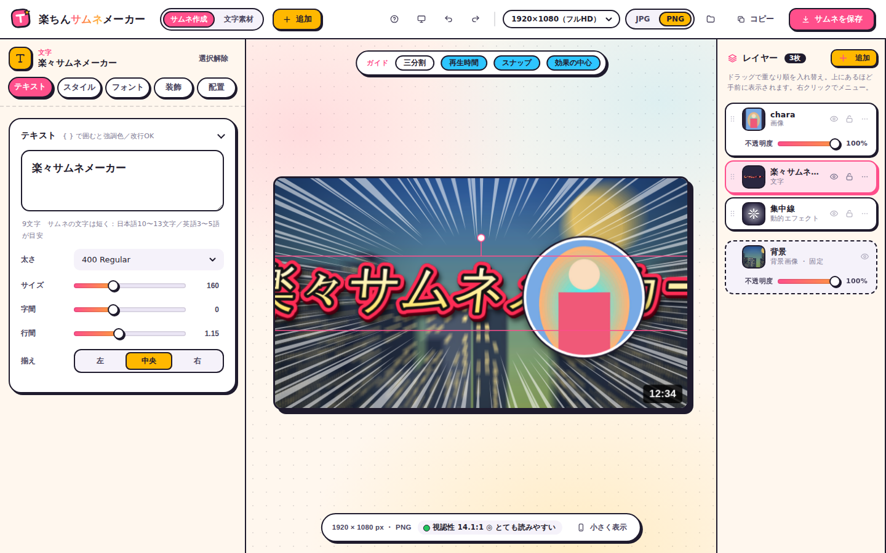

# 楽ちんサムネメーカー

ブラウザだけで使える、YouTube・配信向けのサムネイル作成ツールです。インストール不要で、PCでもスマホでも使えます。

**▶ ツールを開く：https://crash-san1999.github.io/rakuchin-thumb-maker/**

**📖 操作マニュアル：[docs/manual.md](docs/manual.md)**



## できること

- **PWA 対応**：アプリとしてインストールでき、オフラインでも起動。新しいバージョンは画面のお知らせから更新（`manifest.webmanifest`・`sw.js`・`icons/`）
- **背景透過**：画像の背景色を指定して透明に（スポイト・許容値・外側から／全体・縁のなじませ・にじみ除去）、消す／戻すブラシで仕上げ。元の画像は変えずに後から調整できる
- **更新履歴**：ヘルプの「更新履歴」から、追加した機能を新しい順に確認できます（未読があると「？」に赤い点）。[CHANGELOG.md](CHANGELOG.md) にも同じ内容があります
- **画像の縁・影**：フチの二重／グラデ／ぼかし、光彩、影の色・大きさ・位置。文字のフチにもぼかし・光彩
- **背景シェイプの吹き出し**：角丸・四角・楕円・雲（考え中）・叫びの吹き出し。しっぽの位置（自由な角度も）・先の向き・大きさ・太さ・曲がりを変えられる（切り抜きフレームの吹き出しも）
- **素材置き場**：いつも使う画像・文字スタイルをブラウザにストック（上限 200MB・満杯は明示）。バックアップの書き出し／読み込み対応
- **サムネ作成（初期 1920×1080。縦配信 1080×1920 など、サイズの選択・自由指定も可。YouTube チャンネルアート／Twitch バナーはセーフエリアのガイド付き）**：背景・文字・画像をレイヤーで重ねて作成。PNG / JPG で書き出し（1280×720〜4K）
- **縦書き**：上から下・右から左。句読点・小さい仮名・長音・括弧の補正、縦中横（20・!!）、英数字の正立／横倒し、全装飾に対応
- **文字装飾**：79種のプリセット（対戦格闘、速報、勝利、eスポーツ、ダメージ数字、明朝エレガント、ゆめかわ、ハロウィン、心霊など、ジャンル別のカテゴリで絞り込み）、フチ・立体・影・光彩・ベベル・金属光沢・ワープ変形・グリッチほか
- **配色**：ワンクリックの配色シャッフル、サムネ向けおすすめ配色、背景画像から自動配色、視認性チェック
- **フォント**：Google Fonts の日本語フォント全68書体と欧文約1,860書体を最初から収録（キー不要）。源柔ゴシック・源泉丸ゴシック・源様明朝・原ノ味ゴシック・Gen Interface JP・にくまるフォント・異世明・零ゴシックなど漢字入りドットフォントなど53書体のWebフリーフォント、URLからのWebフォント追加、PC内フォント、フォントファイルの読み込み
- **背景エフェクト**：画像の拡大縮小・回転、ズームブラー、モーションブラー、モノクロ、デュオトーン、周辺減光、グラデーション影など（中心位置も調整可）
- **仕上げエフェクト**：文字・画像も含めたサムネ全体に、色フィルター（シネマ・エモい・フィルム・ネオン・夕焼け・サイバー・和風など17種）、ブルーム、光漏れ、フィルムの粒子、色ずれ、走査線、網点、紙の質感、傷・ほこり。ワンクリック仕上げ16種
- **背景の追加エフェクト**：ポスタライズ、2値化、ミニチュア風、柄を重ねる（ドット・ストライプ・放射ラインなど）。ワンクリック背景エフェクト36種
- **加工エフェクト**（背景画像・画像レイヤー・分割フレームのマス・グループで共通）：色収差、グラデーションマップ、色の置き換え、網点、線画、油絵風、シャープ、ノイズ、ゆがみ（波・渦巻き・魚眼・すぼめる）
- **動的エフェクト**（29種）：集中線・光・キラキラ・爆発・放射光・スピード線・ガーン線・紙吹雪・雪・雨・稲妻・ボケ・ハート・星、マンガ（ウニフラ／ベタフラ・怒りマーク・汗・どんより・！？）、光（レンズフレア・十字の光・オーラ）、演出（炎・煙・ヒビ割れ・グリッチ・桜／葉っぱ・泡／しぶき）、ゲーム配信（衝撃波・ヒット・ピカピカ）
- **動的エフェクト**：集中線・光・キラキラ・爆発をレイヤーとして追加し、移動・拡大・回転
- **レイヤー**：ドラッグで重なり順を入れ替え、ロック、描画モード、右クリック／長押しメニュー。複数のレイヤーを**グループ**にして、移動・拡大縮小・回転・効果をまとめて適用
- **画像のドラッグ＆ドロップ／貼り付け**：画面のどこに落としてもレイヤーとして追加
- **切り抜きフレーム**：画像を38種類の形（筆の塗り・破れ紙・かすれ筆も）で切り抜き、ネオン・メタル・ゲーミングRGB・フィルムなど26種類の枠を付けられる。ワンクリック40種類。フレームの位置と大きさもキャンバス上で調整可能
- **新規作成**：今の作業を保存してから、まっさらな状態で作り始められる（取り消しで戻せる）
- **分割フレーム**：2〜8枚の画像を縦・横・グリッド・大1＋小・放射状・上下2段（週の予定表向け）に並べる。マスには背景色や文字も入れられ、指定した1週間の日付・曜日を自動で入れる機能もある。境界はギザギザ・波・ぼかしてつなげる・光る線などから選べる
- **文字素材モード**：文字だけを透過PNGで書き出し
- **PC / スマホ自動判定**：スマホではボトムシート＋ピンチ操作の画面に自動で切り替え

## データについて

作ったサムネや読み込んだ画像は、すべて使っている人のブラウザの中だけに保存されます（サーバーには送信されません）。

## セキュリティについて

- **データの扱い**：サーバーは使いません。画像・作りかけはすべて使っている人のブラウザの中だけに保存されます（上の「データについて」）。
- **スクリプトの実行制限（CSP）**：`index.html` の Content-Security-Policy で、スクリプトは同じ場所のファイルしか実行しません。万一 HTML が差し込まれても、インラインのスクリプトは動きません。
- **他人から受け取ったファイルへの備え**：プロジェクト（.json）や素材置き場のバックアップは、読み込むときに検査します。レイヤー・素材の id は英数字・`_`・`-` だけ許可し、色は `#rgb`／`rgb()`／`hsl()` の形だけ通します。画像は `data:image/` だけ受け付けます（外部URLの画像だと、開いただけで第三者のサーバーに接続してしまうため）。画面に出す文字は HTML エスケープします。
- **外部への通信**：フォント（Google Fonts・jsDelivr・Fontsource の API）と、ユーザーが自分で入れたフォントURL・ドラッグした画像のURL、アクセス数の計測（Cloudflare Web Analytics）だけです。画像やテキストを外部へ送ることはありません。
- **アクセス数の計測**：公開サイトの閲覧数を Cloudflare Web Analytics で数えています。Cookie は使わず、送るのはページを開いた回数・参照元・国・端末の種類などだけです。CSP で外部から読み込めるスクリプトは `https://static.cloudflareinsights.com` だけに限っています（テストは `tests/test_security.py`）。
- **開発のルール**：ユーザーの入力やファイルの値を HTML（`innerHTML` など）に入れるときは、`escapeHtml()`（文字）か `safeColor()`（色）、`okId()`（id）を必ず通します。テストは `tests/test_security.py` です。

## ファイル構成

ビルド不要の静的サイトです。`index.html` をブラウザで開くか、GitHub Pages でそのまま動きます。

```
index.html                 画面の骨組み（HTML）
css/app.css                スタイル
js/core.js                 共通の小道具（$・保存・トースト・数値や色の変換・乱数・ダウンロード・レイヤー初期値）・アイコン
js/bind.js                 入力欄と値をつなぐしくみ（文字パネル・サムネ用で共通）
js/presets.js              文字スタイルのプリセット
js/data/font-list.js       Google Fonts 全書体の一覧データ
fonts/                     同梱フォント（フロップデザイン系ほか。ライセンス付き）
sw.js                      Service Worker（フォントと本体の端末保存・更新の検知）
manifest.webmanifest       アプリ情報（PWA）
icons/                     アプリのアイコン
js/fonts.js                フォント管理（Google Fonts・Webフリー・PC内・URL追加）
js/controls.js             文字の操作パネル（テキスト・装飾）の生成と同期
js/text-render.js          文字の描画エンジン・装飾
js/text-plate.js           文字の背景シェイプ（角丸・楕円・ギザギザ・吹き出し）と吹き出しのしっぽ
js/preview.js              文字素材モードのプレビュー・書き出し・視認性
js/colors.js               配色（パレット・色調整・背景画像からの配色）
js/history.js              取り消し／やり直し
js/thumb/frames.js         画像の切り抜きフレーム（形・枠のデザイン・プリセット）
js/thumb/collage.js        分割フレーム（複数の画像を2〜8分割で並べる）① データの形・マスの効果・分割のしかたの一覧
js/thumb/collage-draw.js   分割フレーム ② 分割の計算・境界の形・マスの画像と文字の描画
js/thumb/collage-cells.js  分割フレーム ③ 位置→マスの判定・マスの文字のスタイル・1週間の自動入力・画像の割り当て
js/thumb/collage-panel.js  分割フレーム ④ 操作パネル（マス一覧・背景色と文字タブ）とイベント、レイアウトのアイコン
js/pwa.js                   アプリとして使う（Service Worker の登録・更新のお知らせ・アプリとして追加）
js/thumb/cutout.js         背景透過（色指定で透明化・消す／戻すブラシ）
js/thumb/library.js        素材置き場（画像・文字スタイルのストック、容量の上限、バックアップ）
js/thumb/canvas.js         キャンバスのサイズ（プリセット・自由指定・中身の置き直し）
js/thumb/group.js          グループ（まとめて描画・まとめて動かす・作成と解除）
js/thumb/fx.js             動的エフェクト（集中線・光・キラキラ・爆発・放射光・紙吹雪・雪など）とワンクリック背景エフェクト
js/thumb/fx-draw.js        動的エフェクトの種類ごとの描き方（fx.js はデータと追加・ワンクリックの処理）
js/thumb/imgfx.js          画像の加工エフェクト（色収差・網点・線画・油絵・ゆがみなど。背景・画像・マス共通）
js/thumb/finish.js         仕上げ（全体にかける色フィルター・ブルーム・粒子など）と、背景の追加エフェクト（ポスタライズ・柄など）
js/thumb/assets.js         画像アセット（IndexedDB に保存）・画像や背景の追加
js/thumb/doc.js            サムネのデータ構造・値の読み書き・変更通知
js/thumb/render.js         サムネの描画（文字・画像レイヤー・背景・合成）
js/thumb/overlay.js        選択枠・ハンドル・背景効果の中心の表示
js/thumb/tailhandle.js     吹き出しのしっぽのつまみ（キャンバス上でドラッグして位置・長さ・向きを変える）
js/thumb/editmodes.js      キャンバス上の編集モード（フレーム調整・マスの調整）
js/thumb/layers.js         レイヤーパネル・レイヤーの選択と操作
js/changelog.js            アップデート履歴の元データ（機能を足したら先頭に追記。CHANGELOG.md は tools/gen-changelog.js が生成）
js/thumb/export.js         サムネの書き出し・共有・プロジェクト読み込み
js/thumb/inspector.js      選んだものに合わせた設定パネル（行の定義・ページ切り替え）
js/thumb/events.js         キャンバス・ドラッグ＆ドロップ・ボタンの操作
js/mobile.js               PC／スマホの自動判定・下のバーとシート・タッチ操作
js/popups.js               ポップアップ（操作ガイド・追加メニュー・ファイルメニュー）
js/main.js                 起動（起動時の処理はすべてここの boot() に集約）
tools/bump-version.sh      読み込みURLのバージョン番号をまとめて更新（CHANGELOG.md の生成も行う）
tools/gen-changelog.js     js/changelog.js から CHANGELOG.md を生成
.github/workflows/test.yml push のたびに全テストを自動実行（GitHub Actions）
tools/layout-audit.py      いろいろな画面サイズで文字の切れ・はみ出しを自動点検（--quick で主要サイズだけ）
tools/docs-screenshots.py  説明書（docs/img）の画像をまとめて撮り直す（--decorate-only で飾りだけやり直し）
tools/docs_decorate.py     説明書の画像に、ポップな飾り（水玉の背景・丸い角・ステッカー風の見出し）を付ける
tests/                     自動テスト（Playwright）と、変更前後の見た目を比べるツール（helpers.py が共通部品、run_all.py が全件実行）
tsconfig.json              型チェック（tsc --checkJs）の設定。配信物には関係しない（読み込まれない）
types/types.js             型の定義（DOC・レイヤー各種・文字スタイル・編集モード）。既存のファクトリ関数から型を引くので、キーを足せば自動で反映
types/dom-loose.d.ts       DOM まわりの型を一時的に緩める設定（締め方の手順もここに記載）
docs/manual.md             操作マニュアル
docs/img/                  説明書の画像
```

JavaScript は通常の `<script>` を上から順に読み込み、共通の変数や関数を共有しています。読み込み時にすぐ実行されるコードは、それより前のファイルにあるものしか使えないので、`index.html` の並びは変えないでください（関数の中から呼ぶぶんには順番は関係ありません）。

ファイルを変更したら `tools/bump-version.sh` を実行してください。`index.html` の `?v=` がまとめて更新され、公開サイトで古いファイルと新しいファイルが混ざらなくなります。

## テストと説明書の画像（開発用）

アプリを動かすだけなら不要です。改修したときの確認用です。Python 3 と Playwright（Chromium）を使います。

```
pip install playwright pillow
python3 -m playwright install chromium   # Chromium が入っていない場合
```

| コマンド | 内容 |
|---|---|
| `python3 tests/run_all.py` | 自動テストをすべて実行（`run_all.py fonts -v` のように名前で絞り込み・詳細表示も可。1件ごとの制限時間は既定150秒で、`--timeout=秒` で変更可。止まったテストは失敗扱いにして次へ進み、残ったブラウザも自動で片付けます） |
| `npx -p typescript@6.0.3 tsc -p .` | 型チェックだけを実行（設定は `tsconfig.json`、型の定義は `types/`）。`run_all.py` にも `test_typecheck` として入っていて、Node.js が無い環境では「省略」と表示されます |
| `python3 tests/compare_render.py [比較先]` | 指定したコミット（省略時は直前のコミット）と、動的エフェクト全種類・切り抜きフレームの全形状×全デザイン・分割フレーム・文字の全装飾（文字パネルの定義から自動で作る）の描画結果を**ピクセル単位**で、レイヤーパネルの HTML と保存データの読み込み（normalizeDoc）の結果を**1 文字単位**で比べる（1ピクセルの違いも検出。描き方を整理するリファクタリングの確認用） |
| `python3 tests/compare.py [比較先]` | 指定したコミット（省略時は直前のコミット）と、画面・全プリセットの描画・設定パネルの中身を比べ、見た目が変わっていないか確認 |
| `python3 tools/docs-screenshots.py` | 説明書の画像を今の画面で撮り直す |

テストは外部との通信をすべて止めた状態で行います（Web フォントは読み込まれません）。テスト用の画像は `tests/fixtures/make_fixtures.py` がその場で描いて作るので、リポジトリには入っていません。

### 機能を足すときのテストの見直し

新しい機能を足したら、その機能のテストを書き足すだけでなく、**機能に合わせてテスト全体を見直します**。

- **画面と同じ経路で確かめる**：描画キャッシュ（`prevCache`）を消してから比べるテストは、「設定を変えても画面が変わらない」不具合を見逃します。見た目の確認は、実際の画面と同じく `paintPreview(false)` をキャッシュを残したまま呼んで行います
- **キャッシュの印**：描画に効く項目をレイヤーに足したら、キャッシュの印（`drawCollage` の `sk` など）にも入れます。`tests/test_cache_consistency.py` が全レイヤーの全項目を自動で集めて、キャッシュありと描き直しが同じ絵になるかを確かめます（項目を足すと自動で対象になります）
- **保存データ**：項目を足したら、既定値（`*_BASE`）・読み込み（`normalizeDoc`）・不正な値の補正（`sanitizeDocRefs`）・古いデータの扱いをテストし、`tests/test_security.py` の細工したプロジェクトにもその項目を入れます
- **ほかの機能との組み合わせ**：同じ画面・同じデータを使う既存の機能（例：マスごとの調整と全部のマスのまとめての調整）を一緒に動かして、互いに影響しないことを確かめます
- **テストの検出力**：足したテストは、わざと実装を壊して（キャッシュの印から外す、補正を外すなど）失敗することを確かめます
- **見た目を変えない部分**：`tests/compare_render.py` で、新機能以外の描画・読み込み結果が変わっていないことを確かめます
