# 楽ちんサムネメーカー 操作マニュアル

**▶ ツールを開く：https://crash-san1999.github.io/rakuchin-thumb-maker/**

ブラウザだけで使える、YouTube・配信向けのサムネイル作成ツールです。インストールもログインも不要で、PC でもスマホでも使えます。

## 目次

1. [はじめに：3分でサムネを作る](#1-はじめに3分でサムネを作る)
2. [画面の見かた](#2-画面の見かた)
3. [追加メニュー](#3-追加メニュー)
4. [背景](#4-背景)
5. [文字](#5-文字)
6. [フォント](#6-フォント)
7. [画像](#7-画像)
8. [切り抜きフレーム](#8-切り抜きフレーム)
9. [分割フレーム（複数の画像を並べる）](#9-分割フレーム複数の画像を並べる)
10. [動的エフェクト](#10-動的エフェクト)
11. [レイヤーパネル](#11-レイヤーパネル)
12. [キャンバスの操作とガイド](#12-キャンバスの操作とガイド)
13. [保存・ファイルメニュー](#13-保存ファイルメニュー)
14. [文字素材モード（透過PNG）](#14-文字素材モード透過png)
15. [スマホでの使い方](#15-スマホでの使い方)
16. [ショートカット一覧](#16-ショートカット一覧)
17. [こまったときは](#17-こまったときは)

---

## 1. はじめに：3分でサムネを作る

| 手順 | やること |
|---|---|
| ① 背景 | 「＋追加」→「背景画像」で画像を選ぶ。画像を画面にドラッグして「背景にする」に離してもOK |
| ② 文字 | キャンバスの文字をクリックして、左の「テキスト」タブで入力。`{ }` で囲んだ部分は強調色になります |
| ③ スタイル | 「スタイル」タブでプリセットを1つクリック。気に入らなければ「配色シャッフル」 |
| ④ 画像・演出 | キャラ画像は画面にドロップ。集中線などは「＋追加」→「動的エフェクト」 |
| ⑤ 保存 | 右上の「サムネを保存」で PNG／JPG を書き出し |

作業内容はブラウザに自動で保存されるので、タブを閉じても次に開いたときに続きから作れます。

起動時に表示される「かんたん操作ガイド」は、右上の **？** ボタンか `?` キーでいつでも開けます。

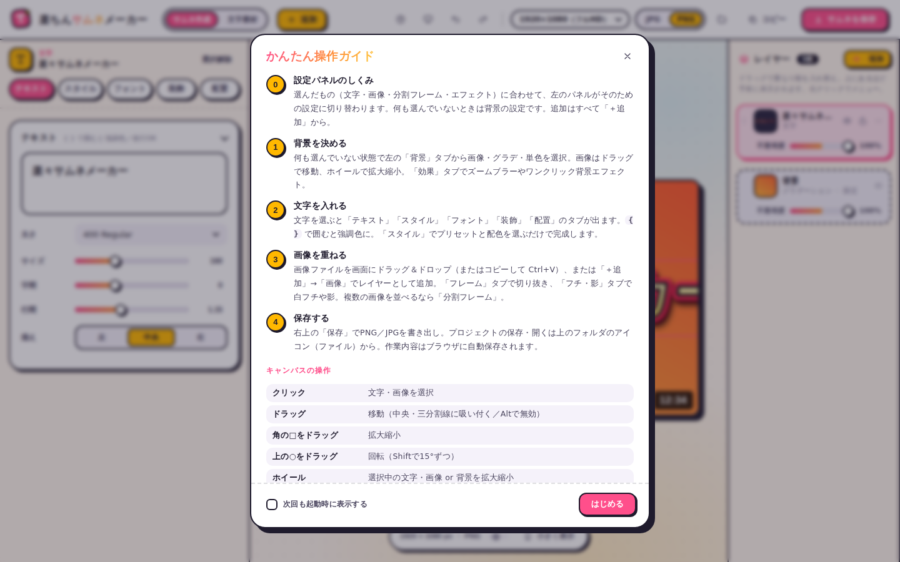

## 2. 画面の見かた

| 場所 | 内容 |
|---|---|
| ヘッダー左 | **サムネ作成／文字素材** の切り替え、**＋追加** |
| ヘッダー右 | ヘルプ、PC／スマホ表示の切り替え、元に戻す／やり直し、**キャンバスのサイズ**、書き出しサイズ、JPG／PNG、**ファイル**（フォルダのアイコン）、コピー、保存 |
| 左：設定パネル | **選んでいるものの設定** が出ます（下の表） |
| 中央 | キャンバス（初期値は 1920×1080。縦配信サイズなども選べます）。上にガイド、下に情報バー（視認性・小さく表示） |
| 右：レイヤーパネル | 文字・画像・エフェクトの一覧。上にあるほど手前に表示されます |

### 設定パネルは「選んだもの」に合わせて変わります

キャンバスかレイヤーパネルで何かを選ぶと、左の設定パネルがそのための設定に切り替わります。パネルの上に、何を選んでいるかとタブが出ます。

| 選んでいるもの | タブ |
|---|---|
| 何も選んでいない | **背景**（背景の種類・位置）／**色調**／**効果**（背景エフェクト） |
| 文字 | **テキスト**／**スタイル**（プリセット・配色）／**フォント**／**装飾**／**配置** |
| 画像 | **配置**／**フレーム**（切り抜きフレーム）／**フチ・影** |
| 分割フレーム | **分割**／**マスの画像**／**効果**／**配置** |
| 動的エフェクト | **エフェクト**／**配置** |

- 「配置」タブには、大きさ・回転・不透明度・描画モード・ロック・9か所への整列があります（どのレイヤーでも共通）
- 右上の「選択解除」を押すか、キャンバスの何もないところをクリックすると、背景の設定に戻ります
- タブは種類ごとに最後に開いたものを覚えています

## 3. 追加メニュー

文字・画像・分割フレーム・背景画像・動的エフェクトは、すべて **「＋追加」** から追加します（ヘッダー左と、レイヤーパネルの右上にあります）。

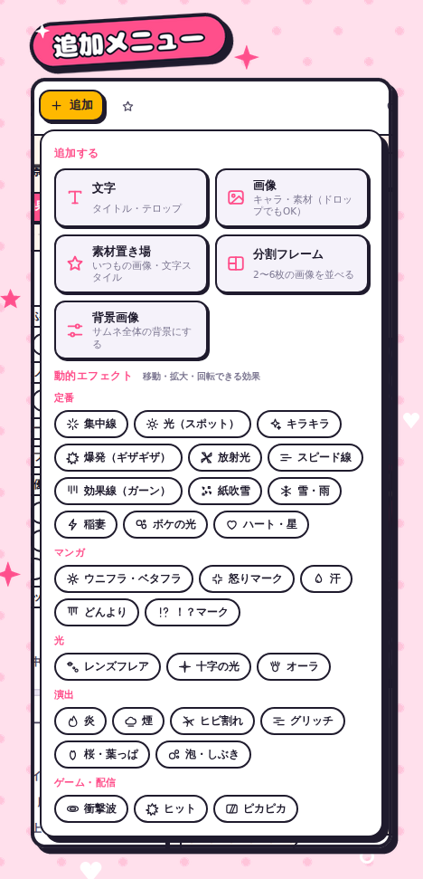

| 項目 | 内容 |
|---|---|
| 文字 | 新しい文字レイヤー |
| 画像 | キャラ・素材などの画像レイヤー（複数まとめて選べます） |
| 分割フレーム | 2〜6枚の画像を並べるレイヤー（→ [9章](#9-分割フレーム複数の画像を並べる)） |
| 背景画像 | サムネ全体の背景にする画像 |
| 動的エフェクト | 集中線・光・キラキラ・爆発（→ [10章](#10-動的エフェクト)） |

画像ファイルは、画面のどこにドラッグ＆ドロップしても画像レイヤーとして追加されます（「背景にする」の枠に落としたときだけ背景になります）。ドラッグ中に出る「**素材置き場に登録**」の枠に落とすと、キャンバスには追加せず、素材置き場にだけ登録されます（素材置き場のバックアップ JSON を落とすと読み込まれます）。コピーした画像を `Ctrl+V` で貼り付けても追加できます。フォントファイル（.ttf / .otf）やプロジェクト（.json）も、同じようにドロップで読み込めます。

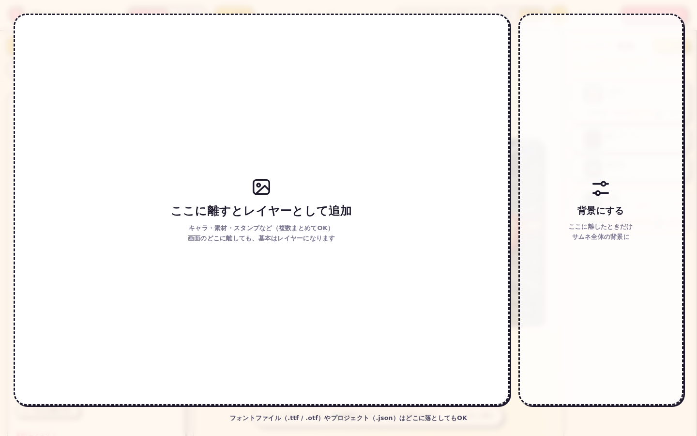

## 4. 背景

何も選んでいないとき、左の設定パネルが背景の設定になります（レイヤーパネルの「背景」の行をクリックしても開きます）。

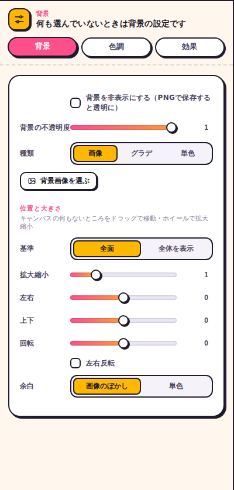
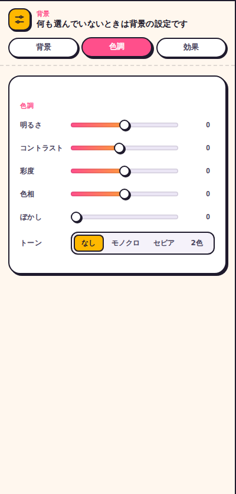
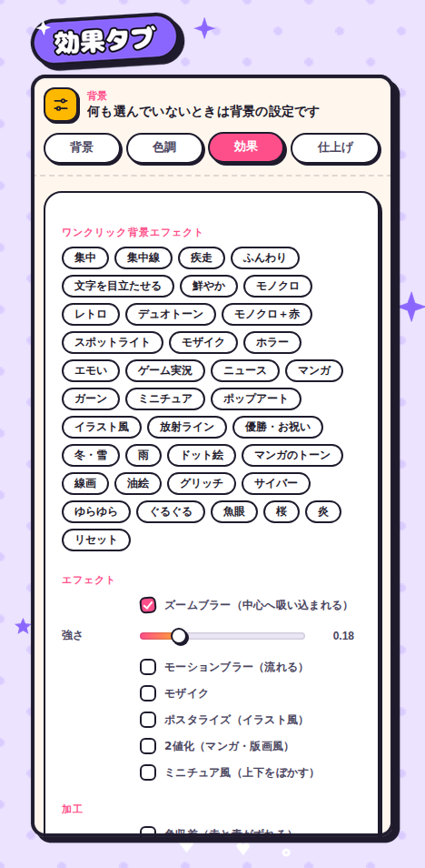

### 背景タブ

- **背景を非表示にする／背景の不透明度**：非表示にして PNG で保存すると、背景が透明な画像になります
- **種類**：画像／グラデ／単色
- **位置と大きさ**（画像のとき）：拡大縮小・左右・上下・回転・左右反転。キャンバスの何もないところをドラッグすると背景が動き、ホイールで拡大縮小できます
- **基準**：「全面」は隙間なく敷き詰め、「全体を表示」は画像全体が見えるように収めます（余った部分は「画像のぼかし」か「単色」で埋めます）

### 色調タブ（背景が画像のとき）

明るさ・コントラスト・彩度・色相・ぼかし・トーン（モノクロ／セピア／2色）。

### 効果タブ

- **ワンクリック背景エフェクト**：集中、集中線、疾走、ふんわり、文字を目立たせる、鮮やか、モノクロ、レトロ、デュオトーン、モノクロ＋赤、スポットライト、モザイク、リセット
- **エフェクト**（背景が画像のとき）：ズームブラー、モーションブラー、モザイク
- **背景エフェクト**：暗くする、周辺減光、グラデーション影（下を暗くして文字を読みやすく）、色を重ねる
- **中心 左右／上下**：周辺減光とズームブラーの中心。キャンバスの **黄色い◎** をドラッグしても動かせます（何も選んでいないときに出ます。上のガイドの「効果の中心」で表示の切り替え）

> ワンクリックの「集中線」「スポットライト」は、動的エフェクトのレイヤーを自動で作ります。あとから移動・調整でき、別のワンクリックに切り替えると入れ替わります。自分で追加した動的エフェクトはそのまま残ります。

## 5. 文字

キャンバスの文字をクリックすると、左に文字の設定が出ます。キャンバス上の文字をダブルクリック（スマホはダブルタップ）すると、すぐに「テキスト」タブで入力できます。

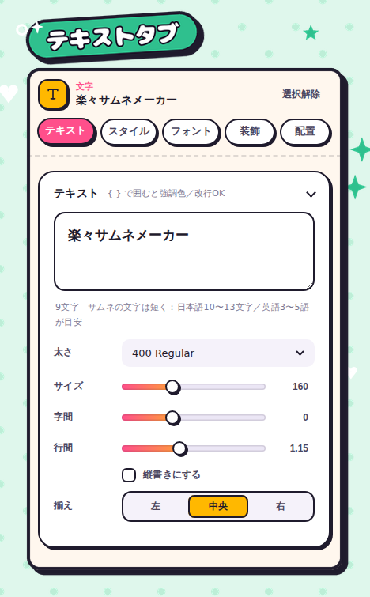
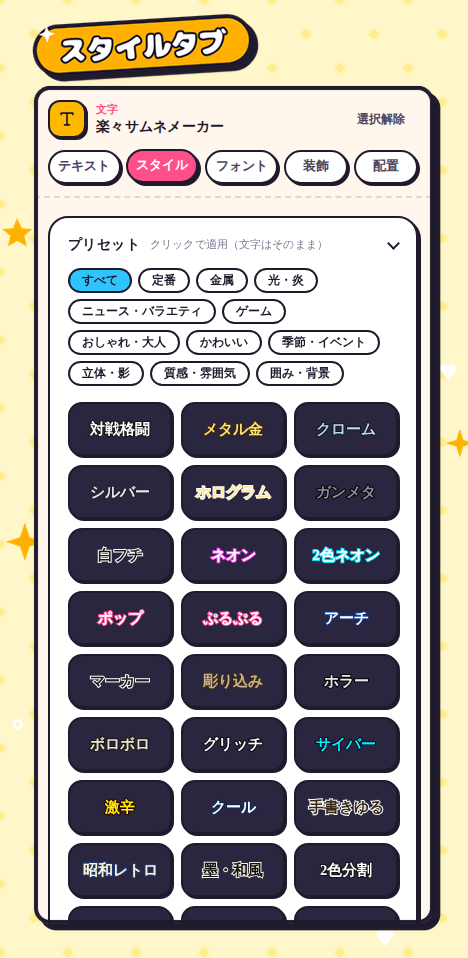
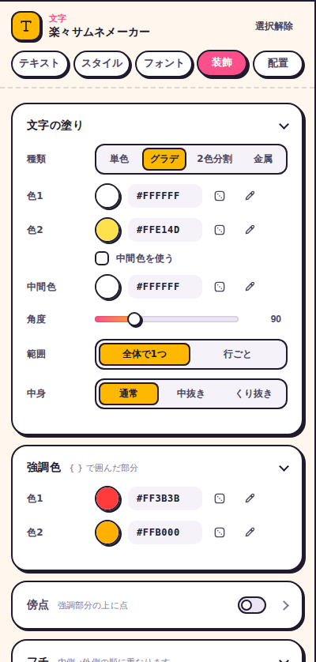

### テキストタブ

- 改行するとそのまま複数行になります
- `{ }` で囲んだ部分は **強調色** になります（例：`今日は{神回}確定`）
- 太さ・サイズ・字間・行間・揃え
- **縦書き**：「縦書きにする」にチェックすると、上から下へ・列は右から左へ並びます（1行目が一番右）
  - 揃えは **上／中央／下** になり、字間は縦の文字送り、行間は列と列の間隔になります
  - 句読点（、。）は右上へ、小さい仮名（ゃ・っ など）は少し右上へ、長音（ー）・括弧・波線・「…」は縦向きに回転して表示されます
  - **縦中横**：`20` や `!!` `?!`（数字・!・? が2〜4文字続いたもの。全角の `２０` `！！` も対象）を、横向きのまま1マスに収めます（チェックで切り替え）
  - 英数字は **立てる**（1文字ずつ正立）か **横倒し**（右に90°倒して連続表示）を選べます
  - 各文字は、フォント内の余白に関係なく **見えている部分の中心がマスの中心** に揃います
  - 斜体は列全体ではなく **1文字ずつ** 傾くので、下の文字が横にずれません
  - 傍点は文字の右側に付き、テカリは左から当たります。そのほかの装飾（フチ・立体・影・光彩・ベベル・背景シェイプ・一文字囲み・ゆらぎ・ワープなど）もそのまま使えます
  - 縦書きの指定がないプリセットを選んでも、今の向きは変わりません。縦書きで保存した文字スタイルは、素材置き場から縦書きで呼び出せます
- 文字レイヤーは「＋追加」→「文字」でいくつでも置けます

### スタイルタブ

- **プリセット**：対戦格闘、メタル金、ネオン、炎、ホラーなど 40 種類以上。文字はそのままで見た目だけ変わります。カテゴリで絞り込めます
- **今の設定を保存**：自分で調整したスタイルをプリセットとして保存
- **初期化**：スタイルを最初の状態に戻します（文字はそのまま）
- **配色シャッフル**：色だけをランダムに変更。横のメニューで「補色」「類似色」「パステル」「ダーク・ネオン」などの方向性を選べます。「文字の塗り色は変えない」で塗り色を固定したままシャッフル
- **サムネおすすめ／カラーテーマ**：実績のある配色パターンをワンクリックで適用
- **全体の色調整**：色相・彩度・明るさをまとめて動かせます
- **背景画像から配色**：背景画像の色に合う配色を自動で作ります

### 装飾タブ

- **文字の塗り**：単色／グラデ／2色分割／金属
- **強調色**：`{ }` 部分の色
- **フチ**：何重にも重ねられます（内側→外側の順）
  - 「フチのぼかし」でフチ全体をぼかし、「フチの光彩」でフチの外側を光らせられます（色・広がり・濃さ・強さ）
- **立体・影・光彩・ベベル・金属光沢**
- **変形**：ワープ変形、傾き・回転、ゆがみ、文字ゆらぎ
- **演出**：傍点、一文字囲み、背景シェイプ、模様、グリッチ、残像、炎、ドリップ、キラキラ、看板の電飾風、鏡面反射、床に映り込み
- **背景シェイプの吹き出し**：「背景シェイプ」の形に、吹き出し（角丸）・吹き出し（四角）・吹き出し（楕円）・雲（考え中）・叫び（ギザギザ）を追加しました。「しっぽの向き」（左下・下・右下・左上・右上・左・右・なし）と「しっぽの大きさ」を選べます
  - **一文字囲み**：1文字ずつ図形（四角・角丸・丸・ひし形）で囲みます。「ランダム配色（脅迫状風）」をオンにすると、**使う色数**（2〜8）と、8つの色を自由に選べます。「おまかせ」から色の組み合わせ（脅迫状・パステル・ポップ・モノクロ・赤黒白・寒色・暖色・和風）をワンクリックで入れ替えられます。「並び方」の「別パターンにする」で色の並びを変え、「ランダムにせず、順番に使う」で1文字目から順に使えます

各セクションの右上のスイッチでオン／オフを切り替えられます。

### 配置タブ

大きさ・回転・不透明度・描画モード・ロック・9か所への整列。

## 6. フォント

文字を選んで「フォント」タブで選びます。

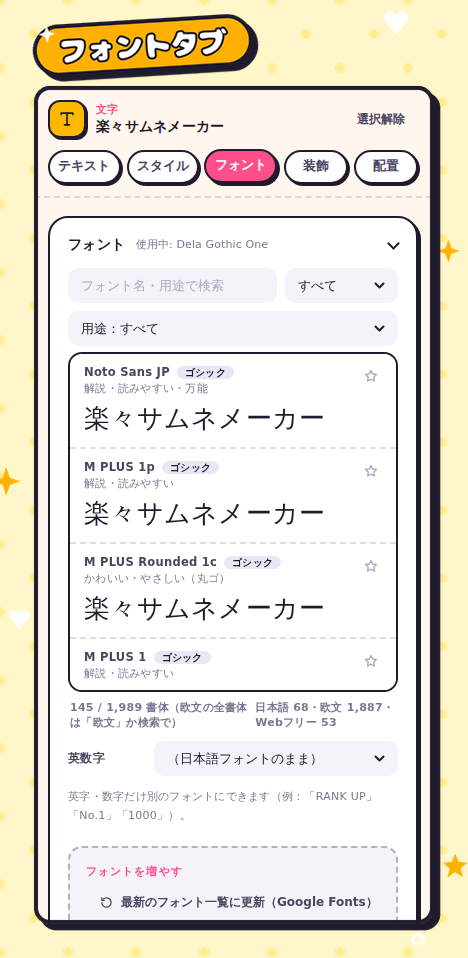

#### 最初から使えるフォント

設定やキーは不要で、次のフォントが最初から一覧に入っています。

| 種類 | 数 | 内容 |
|---|---|---|
| Google Fonts 日本語 | 68 | Dela Gothic One、LINE Seed JP、BIZ UDゴシック、Rock 3D など日本語対応の全書体 |
| Google Fonts 欧文 | 約1,860 | 英数字用。「すべて」には厳選した書体だけが出ます。全書体は「欧文」を選ぶか名前で検索 |
| Webフリー | 53 | Google 以外で配信されているフリーフォント（下の表） |

**Webフリーのおもな書体**（カテゴリ「Webフリー」で絞り込めます）

| フォント | 特徴 |
|---|---|
| Genjyuu Gothic（源柔ゴシック） | 角の丸い太めのゴシック。1書体約3.5MBあり、選んだときに読み込みます |
| Fusion Pixel JP（10px / 12px） | 漢字まで入ったドットフォント。ゲーム系に |
| PixelMplus 10 / 12 | 漢字入りのドットフォント（約1.2MB）。太字もあり |
| x12y16pxMaruMonica（マルモニカ）／ x12y12pxMaruMinya（まるみーにゃ） | 丸みのある漢字入りドットフォント（約3MB） |
| 築豊明朝（Tsukuhou Mincho） | 築地活字風のかなが特徴の明朝体（約7.4MB） |
| 源泉丸ゴシック（GenSen Rounded 2 JP） | 丸ゴシック。太さ 400 / 700 / 900（1書体約16MB） |
| 源石ゴシック（GenSeki Gothic 2 JP） | 少し古風なゴシック。太さ 400 / 700 / 900（1書体約16MB） |
| 源流明朝（GenRyuMin 2 JP） | 明朝体。太さ 400 / 700 / 900（1書体約16MB） |
| 源様明朝（GenYoMin 2 PJP）／ 源起明朝（GenKiMin 2 PJP） | 活字風の明朝体。かなが比例幅で、タイトル向き。太さ 200〜900 の7段階（1書体約13〜16MB） |
| 原ノ味ゴシック（Harano Aji Gothic）／ 原ノ味明朝（Harano Aji Mincho） | 源ノ角ゴシック・源ノ明朝をもとに、日本語向けに字形を整えたもの。ゴシックは6段階（約5MB）、明朝は7段階（約6MB） |
| Gen Interface JP ／ Gen Interface JP Display | 欧文は Inter 風、日本語は Noto Sans JP のゴシック。太さ 100〜800 の8段階。「Display」は見出し向け。文字ごとに分割して配信されるので軽い |
| にくまるフォント | フロップデザインさんの丸ゴシック（M+ FONT ベース）。かわいくポップな見出し向け。太さは1種類（約3MB）。**このリポジトリに同梱**（`fonts/nikumaru/`）しているので、外部サーバーは使いません |
| ラノベPOPv2 | ラノベ風のポップ体（フロップデザイン）。太さ1種類（約2MB）。同梱 |
| 07やさしさゴシック ／ 07やさしさゴシックボールド | 丸みのあるやさしいゴシック（フォントな）。通常は約3MB、ボールドは約1MB。同梱 |
| どきどきファンタジア | 極太の丸ゴシック（Zen Maru Gothic 派生・フロップデザイン）。約3MB。同梱 |
| 零ゴシック ／ 異世ゴ | 源ノ角ゴシック派生のゴシック（フロップデザイン）。約4〜5MB。同梱 |
| 異世明 ／ 装甲明朝 ／ 瞬きノ明朝 | 源ノ明朝派生の明朝（フロップデザイン）。約5MB、瞬きノ明朝だけ約26MB。同梱 |
| Notofit JP | 欧文は Outfit 風の丸いゴシック。太さ 100〜900 の9段階。軽い |
| TJ Plus Sans | 丸みのある欧文と M PLUS / Noto Sans JP を合わせたゴシック。太さ 300〜800。軽い |
| Fusion Kai J | 楷書体（約5.7MB・選んだときに読み込み） |
| Nico Moji（ニコモジ）／ Nikukyu（にくきゅう） | ポップな手作り風。かな・英数字のみ（漢字は別の書体で表示） |
| Hannari（はんなり明朝）／ Kokoro（こころ明朝） | やさしい明朝体 |
| Norwester、Peace Sans、Blackout など | 英数字用のインパクト系 |
| DSEG7 / DSEG14 | デジタル時計・電光掲示板風の数字 |

**先読みと端末への保存**：一度読み込んだフォントは、ブラウザの中（Service Worker）に保存されるので、次回からは通信せずにすぐ使えます。フォントの★（お気に入り）を押すと、そのフォントを先に読み込んでおきます。お気に入りのフォントは、次回以降も起動して数秒後に自動で読み込まれます（データ通信量の節約設定やモバイル回線のときは自動では読み込みません）。ブラウザのサイトデータを消すと保存も消えます。

1MB を超えるフォントは、一覧をスクロールしただけでは読み込まず、選んだときに読み込みます（「選ぶと読込」と表示）。一度読み込めば、次からはすぐに表示されます。約16MBの源泉丸ゴシックなどは、スマホの通信量に気をつけてください。太さごとにファイルが分かれているので、使う太さの分だけ読み込まれます。Gen Interface JP などの「分割配信」のフォントは、使う文字の分だけ読み込むため軽く、そのまま一覧で試せます。

Webフリーのフォントは、それぞれのライセンスで配布されています。原本のファイルをそのまま、配布元（Google Fonts、Fontsource、作者の GitHub リポジトリ）から jsDelivr 経由で読み込んでいます。ただし「同梱」と書いてある書体は、このリポジトリの `fonts/` に、ライセンス文とあわせて入れてあります（配信サイズを抑えるため、中身を変えずに WOFF 形式へ変換）。

| フォント | 作者・配布元 | ライセンス |
|---|---|---|
| 源柔ゴシック | 自家製フォント工房 | SIL OFL 1.1 |
| Fusion Pixel / Fusion Kai | TakWolf、lxgw | SIL OFL 1.1 |
| PixelMplus | itouhiro、M+ FONTS PROJECT | M+ FONT LICENSE |
| にくまるフォント | フロップデザイン（Fontna.com）、M+ FONTS PROJECT | M+ FONT LICENSE（商用・再配布可。`fonts/nikumaru/` にライセンスを同梱） |
| ラノベPOPv2 | フロップデザイン、M+ FONTS PROJECT | M+ FONT LICENSE |
| 07やさしさゴシック | Fontna.com、M+ FONTS PROJECT、IPA | M+ FONT LICENSE ／ IPAフォントライセンス v1.0 |
| 07やさしさゴシックボールド | Fontna.com、M+ FONTS PROJECT | M+ FONT LICENSE |
| どきどきファンタジア・零ゴシック・異世ゴ・異世明・装甲明朝・瞬きノ明朝 | フロップデザイン（元: Zen Project／Adobe） | SIL OFL 1.1 |
| マルモニカ・まるみーにゃ | hicc（[x0y0pxFreeFont](https://hicchicc.github.io/00ff/)） | 作者独自ライセンス（商用・再配布可） |
| 築豊明朝 | iose-sakana | SIL OFL 1.1 |
| 源泉丸ゴシック・源石ゴシック・源流明朝・源様明朝・源起明朝 | ButTaiwan | SIL OFL 1.1 |
| 原ノ味ゴシック・原ノ味明朝 | trueroad | SIL OFL 1.1 |
| Gen Interface JP（Display 含む） | Yamato Iizuka | SIL OFL 1.1 |
| Notofit JP | PocoPota | SIL OFL 1.1 |
| TJ Plus Sans | minumarapid | SIL OFL 1.1 |
| ニコモジ・にくきゅう・はんなり明朝・こころ明朝 | Google Fonts Early Access | SIL OFL 1.1 |

#### 探す・選ぶ

- **検索・カテゴリ・用途**：「ゲーム・インパクト」「かわいい・ポップ」「和風・筆」など用途から探せます
- **英数字**：英字・数字だけ別のフォントにできます（例：「RANK UP」「No.1」）。一覧の欧文フォントにある「英数字」ボタンからも設定できます
- **お気に入り**：よく使うフォントを登録。お気に入りにした欧文は「英数字」の選択肢にも出ます

#### フォントを増やす

- **最新のフォント一覧に更新**：Google Fonts に新しく追加された日本語フォントを取り込みます。週に1回は自動でも確認します
- **WebフォントのURLを貼り付け**：次のURLに対応しています。追加したフォントは次回も一覧に残ります
  - Google Fonts のフォントのページ（`https://fonts.google.com/specimen/…`）
  - Google Fonts の CSS（`https://fonts.googleapis.com/css2?family=…`）
  - Fontsource のフォントのページ（`https://fontsource.org/fonts/…`）
  - `@font-face` を書いた CSS のURL
  - フォントファイルのURL（.woff2 / .woff / .ttf / .otf）。配布元が外部サイトからの利用を許可していない場合は読み込めません
- **PC にインストール済みのフォントを読む**（PC のみ）：Chrome / Edge ではインストール済みフォントをすべて読み込めます。初回は「フォントの使用」の許可を求められます。許可できない環境でも、よく使われるフォントは自動で見つけます
- **PC内のフォント名を入力して追加**：一覧に出てこないフォントも、名前を入れれば使えます（例：けいふぉんと）
- **フォントファイル**：.ttf / .otf / .woff / .woff2 をドロップ、またはクリックして選択

> ダウンロード配布だけのフリーフォント（けいふぉんと、にくまるフォントなど）は、PC にインストールしてから「PC にインストール済みのフォントを読む」か、フォントファイルをドロップしてください。

## 7. 画像

キャラクターの立ち絵、スタンプ、ロゴなどは **画像レイヤー** として重ねます。「＋追加」→「画像」か、画面へのドラッグ＆ドロップ・貼り付けで追加します。

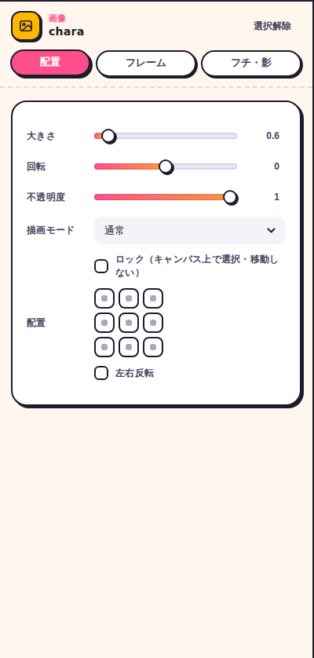
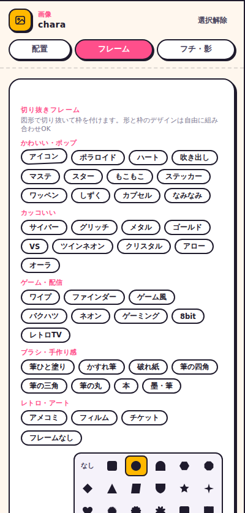
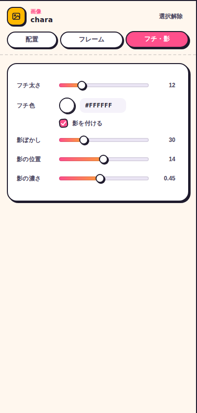

- **配置タブ**：大きさ・回転・**反転**・不透明度・描画モード・ロック・9か所への整列
  - **反転**：「左右」「上下」ボタンで画像を反転します（押すたびに切り替わり、反転中はボタンが黄色になります）。キーボードの `H`（左右）・`V`（上下）や、右クリックメニューからもできます。切り抜きフレームを付けているときは、フレームの位置や形はそのままで中の絵だけが反転します
- **フレームタブ**：図形で切り抜いて枠を付けます（→ [8章](#8-切り抜きフレーム)）
- **フチ・影タブ**：切り抜き画像（背景が透明な PNG）のまわりに白フチ、画像に影。追加した直後はフチも影もなしです（「フチを付ける」「影を付ける」で付けられます）。「フチ太さ」は右の数字欄に 0.37 のように入力すると 0.01 単位で決められます（数字欄で ↑↓ キーでも 0.01 ずつ変わります）
  - **フチの種類**：ふつう／二重（外側にもう1色）／グラデ（上→下で2色）。「フチのぼかし」で縁をふんわりぼかせます（枠なしの画像のとき）
  - **光彩**：絵とフチの外側がぼんやり光ります（色・広がり・濃さ・強さ）。枠付きの画像にも使えます
  - **影**：色、大きさ（ふくらみ）、ぼかし、位置（横・縦）、濃さを変えられます
- **色タブ**：画像の **明度**（明るさ）と **彩度**（鮮やかさ）を、スライダーで −（暗く・くすませる）〜＋（明るく・鮮やかに）に変えられます。フチ・影は変わらず、絵だけに効きます。切り抜きフレームを付けた画像にも効きます。「元に戻す」で 0 に戻ります
- **背景透過タブ**：画像の背景を透明にします。元の画像は変わらないので、あとから設定を変えたり戻したりできます（プロジェクトには設定とブラシの跡だけが増えます）
  - **背景色を透明にする**：チェックすると、画像の四隅の色が背景色になり、その色に近い部分が透明になります。背景色は「画像から色を拾う」（キャンバスの画像をクリック）、「四隅から自動で拾う」、色の欄のどれでも指定できます
  - **範囲**：「外側から」は画像の縁につながっている背景だけを透明にします（人物の服や目の同じ色は残ります）。「全体」は同じ色の部分をすべて透明にします
  - **許容値**：背景色にどこまで近い色を透明にするか。**境界のぼかし**：縁を半透明にしてなじませる。**縁を削る**：透明との境目を内側へ削る（背景色の縁が残るとき）。**なめらかさ**：ギザギザを丸める。**にじみ除去**：縁に残る背景色を、内側の色で置き換えて消す
  - **ブラシで仕上げる**：「キャンバスでブラシを使う」で、画像をなぞって **消す**／**戻す**（元の絵が戻ります）。ホイール（または「ブラシの太さ」）で太さを変えます。消した部分は薄く見えるので、戻す目安になります。「ブラシを1つ戻す」「ブラシの跡をすべて消す」もあります。トリミングや拡大縮小をしても、跡は絵の同じ場所に残ります
  - 単色の背景（グリーンバック・白・無地）はきれいに抜けます。写真の背景など複雑なものは、背景色の透明化とブラシを組み合わせて仕上げてください。切り抜きフレームを使っている画像では、ブラシは使えません（背景色の透明化は使えます）

## 8. 切り抜きフレーム

**表示する範囲（トリミング）**：「フレーム」タブの一番上で、画像の「上・下・左・右を切る」スライダーを動かすと、その辺から切り落とせます（0〜90%）。見えている部分の位置は動きません。「トリミングを戻す」で元に戻ります。切り抜きフレームとも組み合わせられ、その場合は切り落とした範囲の中でフレームが働きます。

画像を図形で切り抜いて、枠を付けられます。画像を選んで「フレーム」タブを開きます。

### ワンクリック（40種類・5グループ）

**かわいい・ポップ**：アイコン、ポラロイド、ハート、吹き出し、マステ、スター、もこもこ、ステッカー、ワッペン、しずく、カプセル、なみなみ

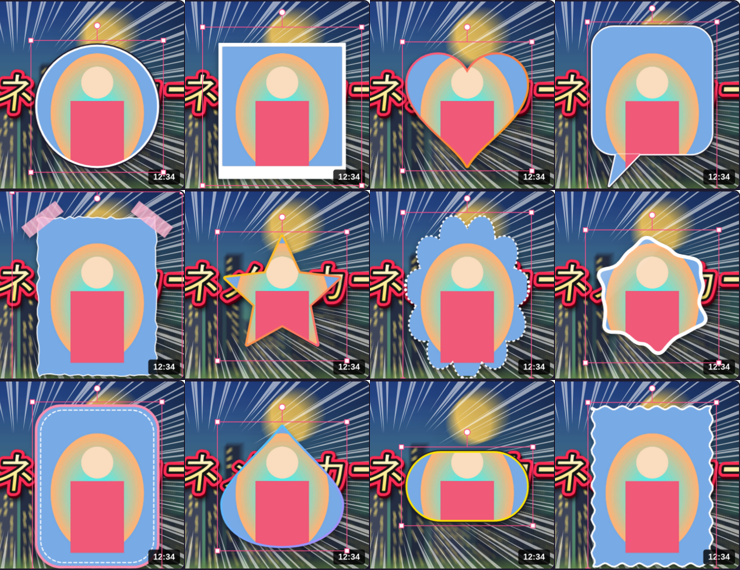

**カッコいい**：サイバー、グリッチ、メタル、ゴールド、VS、ツインネオン、クリスタル、アロー、オーラ

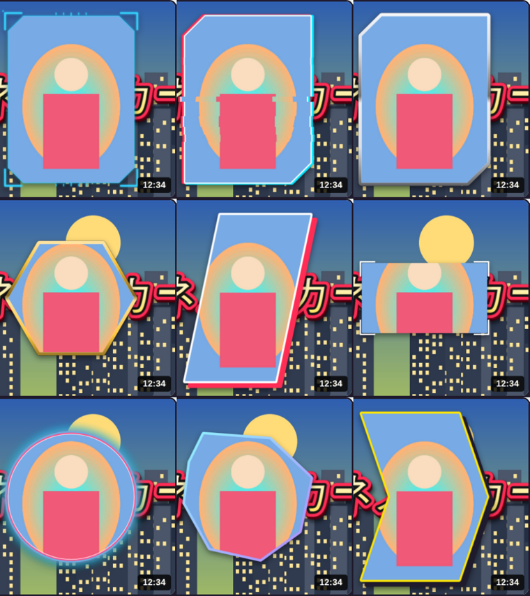

**ゲーム・配信**：ワイプ、ファインダー、ゲーム風、バクハツ、ネオン、ゲーミング、8bit、レトロTV

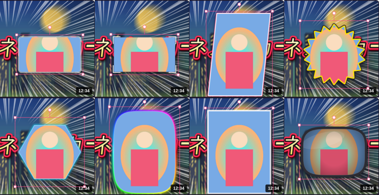

**ブラシ・手作り感**：筆ひと塗り、かすれ筆、破れ紙、筆の四角、筆の三角、筆の丸、本、墨・筆

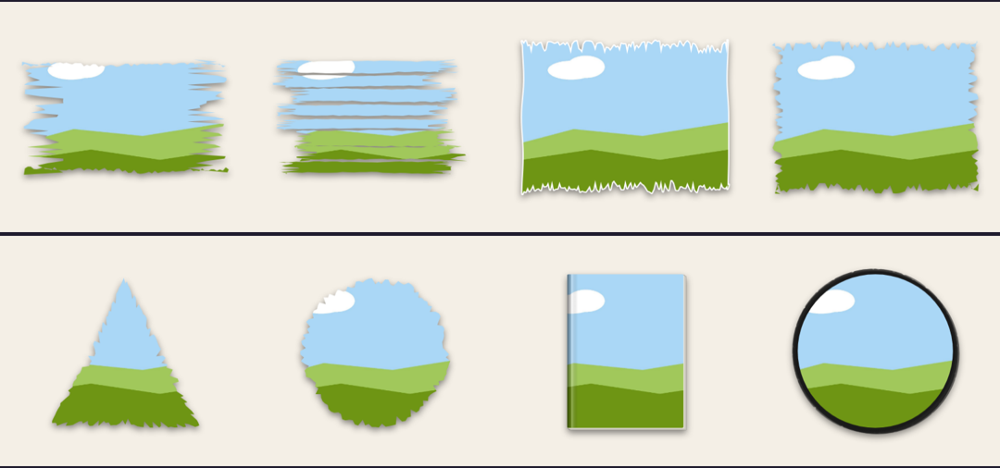

**レトロ・アート**：アメコミ、フィルム、チケット

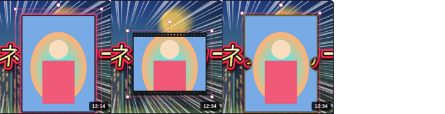

「フレームなし」で元に戻ります。

### 形と枠を自分で組み合わせる

- **形**（38種類）：四角（角丸）、丸、アーチ、六角形、八角形、ひし形、三角、平行四辺形、盾、星、キラッ、ハート、バクハツ、もこもこ、花、吹き出し、ラフな切り口、サイバーカット、HUD（角カット）、ブレード、台形、クリスタル、矢印、カプセル、スクワークル、五角形、縦六角形、十字、しずく、チケット、なみなみ、スプラッシュ、筆のひと塗り、かすれ筆、筆の四角、破れ紙、筆の三角、筆の丸
- **枠のデザイン**（26種類）：枠なし、単色のフチ、二重線、2色フチ（ポップ）、グラデーション、ネオン、2色ネオン、点線、ポラロイド風、マスキングテープ、サイバーHUD、ファインダー（四隅だけ）、グリッチ、メタル、立体影、ゲーミングRGB、オーラ（後光）、三重線、ステッカー、ステッチ（ワッペン）、アメコミドット、墨・筆、フィルム、ブラウン管、ドット絵、本（ページ）
- 枠の色と太さは「フチ色」「フチ太さ」、2色使うデザインは「2色目」で変えます
- **縦横比**：自動／1:1／4:3／3:4／16:9。自動は、四角やアーチなどは元の画像の比率、丸や星などは 1:1 になります
- **筆のかすれ**：筆・破れ紙・ラフな切り口などの形は「別パターンにする」で切り口の形を作り直せます
- 影（「フチ・影」タブ）を付けると、フレームの形に沿って影が付きます
- 枠の外側は透明です。内側は画像で埋まり、画像に透明な部分があれば透けます（ポラロイド風・本・フィルム・オーラは内側に下地を塗るので透けません）

### フレームの位置と大きさ

画像はそのままで、フレーム（切り抜く範囲）だけを動かしたり、大きさを変えたりできます。

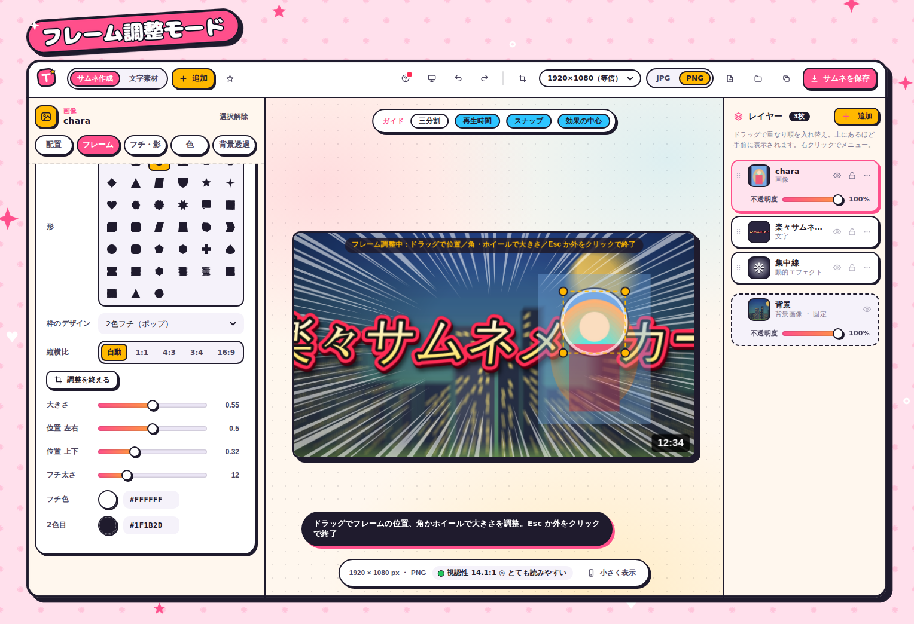

- **フレーム調整モード**：「キャンバスでフレームを調整」を押すか、フレーム付きの画像をダブルクリック（スマホはダブルタップ）すると入ります。画像全体が薄く表示されます
  - ドラッグ：フレームの位置を動かす
  - 角の ● をドラッグ・ホイール（スマホはピンチ）：フレームの大きさを変える
  - Esc・画像の外をクリック・「調整を終える」：モードを終了
- **スライダー**：「大きさ」「位置 左右／上下」でも同じ調整ができます
- 画像全体の大きさや位置を変えたいときは、ふだんどおりレイヤーをドラッグ・拡大縮小します

## 9. 分割フレーム（複数の画像を並べる）

2〜6枚の画像を、きれいに分割して並べられるレイヤーです。「＋追加」→「分割フレーム」で追加します。

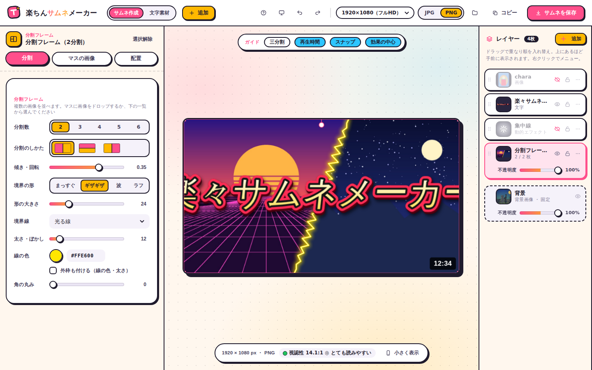

### 分割タブ

- **分割数**：2〜6
- **分割のしかた**：縦に並べる／横に並べる／グリッド（4・6分割）／左に大きく／上に大きく／放射状（中心から扇形）。分割数に合わせて選べるものが変わります
- **傾き・回転**：境界を斜めにします（放射状は回転）。2分割＋斜めで「VS」風になります
- **大きいマスの大きさ**：「左に大きく」「上に大きく」のとき
- **境界の形**：まっすぐ／ギザギザ／波／ラフ（「形の大きさ」で調整）
- **境界線**：線／なし（ぴったり）／すき間（背景が見える）／光る線／ぼかしてつなげる／影で重ねる。「太さ・ぼかし」と「線の色」で調整
- **外枠・角の丸み**：全体のまわりにも線を付けたり、角を丸くしたりできます

### マスの画像タブ

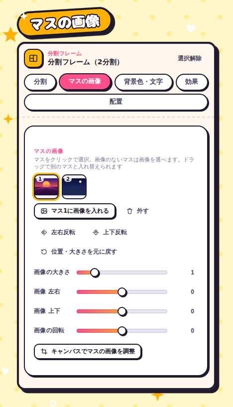

- **画像の入れ方**：分割フレームを**選んでいる状態で**マスにドロップ（複数まとめてドロップすると順番に入ります。選んでいないときは、分割フレームの上に落としても、ふつうの画像レイヤーとして追加されます）、または一覧でマスを選んで「画像を入れる」。画像のないマスをクリックすると、すぐにファイルを選べます
- **画像の大きさ・左右・上下**：選んでいるマスの中の画像を調整
- **マスの調整モード**：分割フレームをダブルクリックするか「キャンバスでマスの画像を調整」で入ります。マスをドラッグで中の画像を移動、ホイール（スマホはピンチ）で拡大縮小
- 画像を入れていないマスの「画像をドロップ」表示は、保存した画像には入りません

### 効果タブ

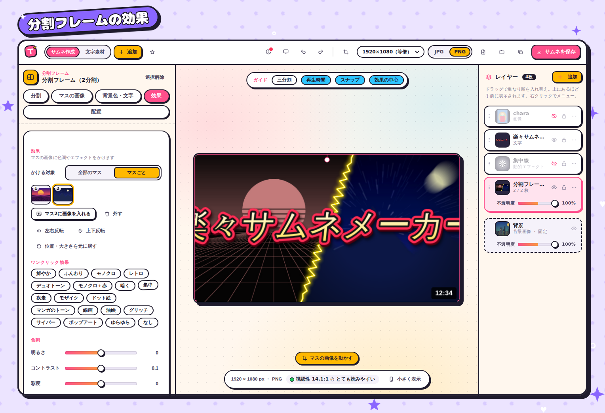

マスの画像に、背景と同じような色調やエフェクトをかけられます。

- **かける対象**：「全部のマス」はすべてのマスに同じ効果、「マスごと」は一覧で選んだマスだけに効果がかかります。「マスごと」に切り替えると、それまでの効果が各マスに写るので、そこから一部のマスだけ変えられます
- **ワンクリック効果**：鮮やか／ふんわり／モノクロ／レトロ／デュオトーン／モノクロ＋赤／暗く／集中／疾走／モザイク／なし
- **色調**：明るさ・コントラスト・彩度・色相・ぼかし・トーン（モノクロ／セピア／2色）
- **エフェクト**：ズームブラー（マスの中心へ吸い込まれる）・モーションブラー・モザイク・暗くする・周辺減光・色を重ねる
- **全体の影**：分割フレーム全体の下に影を付けます。背景の上に浮かせたいときに

### 配置タブ

大きさ・回転などに加えて、**横幅・高さ**と「画面いっぱいにする」があります。

## 10. 動的エフェクト

集中線・光・キラキラ・爆発は、**動的エフェクト** としてレイヤーで追加します。文字や画像と同じように移動・拡大縮小・回転でき、レイヤーパネルで重なり順を変えられます（キャラの後ろに集中線、など）。

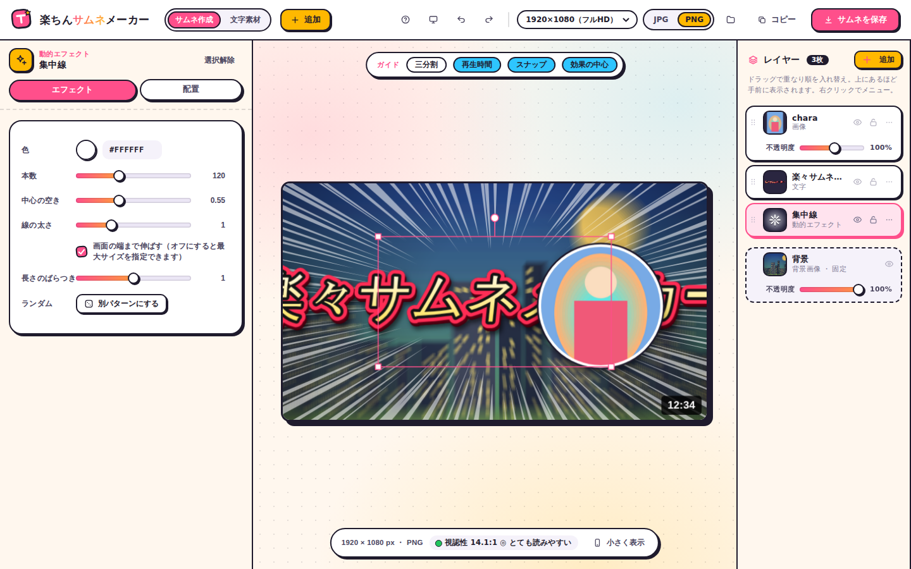

1. 「＋追加」→「動的エフェクト」から種類を選びます
2. 今選んでいるレイヤーの **すぐ下** に追加されます。キャラを選んでから追加すると、キャラの後ろに入ります
3. ドラッグで移動、角の □ で拡大縮小、上の ○ で回転します
4. 「エフェクト」タブで細かく調整します

| 種類 | 調整できる項目 |
|---|---|
| 集中線 | 色、本数、内側の空き、線の太さ、長さのばらつき、ランダム、最大サイズ（最大サイズのスライダーを動かすと「画面の端まで伸ばす」が自動でオフになり、外側の長さと外側のぼかしを指定できます） |
| 光（スポット） | 色、強さ、光の広がり（描画モードは初期値「スクリーン」） |
| キラキラ | 色、数、大きさ、光彩、ランダム |
| 爆発（ギザギザ） | 塗り色、フチ色、フチの太さ、トゲの数、トゲの深さ、ランダム |

背景全体にかける効果（ぼかし・周辺減光・モノクロなど）は、レイヤーではなく背景の設定の「効果」タブにあります（→ [4章](#4-背景)）。

## 11. レイヤーパネル

右のレイヤーパネルで、文字・画像・分割フレーム・動的エフェクトを管理します。

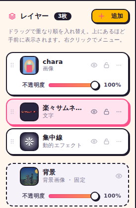

| 操作 | PC | スマホ |
|---|---|---|
| 選択 | 行をクリック | 行をタップ |
| 重なり順の入れ替え | 行をドラッグ（上にあるほど手前） | 左の ⋮⋮ をつまんで上下 |
| 表示／非表示 | 👁 | 👁 |
| ロック（キャンバス上で動かなくなる） | 🔒 | 🔒 |
| 不透明度 | 選んでいる行のスライダー | 選んでいる行のスライダー |
| 名前を変更 | ダブルクリック | メニューから |
| メニュー | 右クリック／… | 長押し／… |

- メニューには、最前面へ、前面へ、背面へ、最背面へ、複製、名前を変更、ロック、グループ関連、削除があります
### グループ（複数のレイヤーをまとめる）

文字・画像・分割フレーム・動的エフェクトなど、どのレイヤーでもグループにまとめられます。まとめると、**移動・拡大縮小・回転・不透明度・描画モード・効果を、中身すべてにまとめて** かけられます。

| 操作 | PC | スマホ |
|---|---|---|
| 複数選択 | `Ctrl`／`Shift`＋クリック（レイヤーの行でも、キャンバス上でも） | 行を長押し。そのあとは、タップで追加・解除 |
| グループにする | パネル上部の「グループにする」／`Ctrl`＋`G`／右クリックメニュー | パネル上部の「グループにする」／長押しメニュー |
| 開く・閉じる | 行の ▾ ▸ | 同じ |
| 中身を1つだけ選ぶ | 行をクリック、またはキャンバスでダブルクリック | 行をタップ |
| 解除 | `Ctrl`＋`Shift`＋`G`／メニュー／グループの「配置」タブ | メニュー／「配置」タブ |

- グループは、重なり順の中で1枚のレイヤーとして動きます。グループの行をドラッグすれば、中身ごと前後に動きます（中身の入れ替えは、同じグループの中だけです）
- グループを選ぶと、キャンバスに全体の枠が出ます。角で拡大縮小、上の○で回転、ドラッグで移動、ホイールやスマホのピンチでも拡大縮小できます。複数選択のままでも、まとめて移動できます（拡大縮小・回転はグループにしてから）
- 「効果」タブでは、中身を1枚の絵にまとめてから、分割フレームと同じ効果（色調・ぼかし・ズーム／モーションブラー・モザイク・暗く・周辺減光・色を重ねる・影）をかけられます
- 「グループから出す」で1つだけ外せます。グループを削除すると、中身も一緒に消えます。複製すると中身もコピーされます

- **背景** は一番下に固定です。行をクリックすると背景の設定が開きます。👁 と不透明度もあり、非表示にして PNG で保存すると背景が透明になります（JPG は透明にできないので白になります）

## 12. キャンバスの操作とガイド

| 操作（PC） | 内容 |
|---|---|
| クリック | 文字・画像・エフェクトを選択 |
| ドラッグ | 移動（中央・三分割線に吸い付く／Alt で無効） |
| 角の □ をドラッグ | 拡大縮小 |
| 上の ○ をドラッグ | 回転（Shift で 15° ずつ） |
| ホイール | 選択中のレイヤー、または背景を拡大縮小 |
| 何もない所をクリック | 選択解除（背景の設定へ） |
| 何もない所をドラッグ | 背景画像を移動 |
| ダブルクリック | 文字：入力／フレーム付き画像：フレーム調整／分割フレーム：マスの調整 |
| 右クリック | レイヤーメニュー |
| Alt＋クリック | 重なった下のレイヤーを順番に選ぶ（絵がある位置のレイヤーだけを回ります） |
| クリックの判定 | 文字や画像の四角い枠ではなく、実際に絵がある部分（細い文字はすぐ近くも）でつかみます。上のレイヤーの透明な部分では、下のレイヤーをつかめます。また、選択中のレイヤーの絵がある位置では、手前に別のレイヤーが重なっていても、選択中のレイヤーを優先してつかみます（別のレイヤーに切り替えるときは、重なっていない場所をクリックするか、Alt＋クリック、レイヤーパネルから） |
| ホイール | 選択中のレイヤーの絵の上（すぐ近く）なら、手前に別のレイヤーがあっても選択中のレイヤーを拡大縮小します |
| 黄色い ◎ をドラッグ | 背景エフェクトの中心を移動 |

**ガイド**（キャンバス上部）

- **三分割**：構図の目安になる三分割線
- **再生時間**：YouTube の再生時間表示（右下）の位置。文字がかぶらないかの確認用。書き出しには入りません
- **スナップ**：中央・三分割線への吸い付きのオン／オフ
- **効果の中心**：背景エフェクトの中心 ◎ の表示

**情報バー**（キャンバス下部）

- **視認性**：文字の塗りと、そのすぐ外側（フチ・影・背景）の明るさの差です。◎ なら小さく表示されても読みやすい目安になります
- **小さく表示**：YouTube のおすすめ欄くらいの大きさで見え方を確認できます。押すとボタンが「大きく表示」に変わり、もう一度押すと元の大きさに戻ります

## 13. 保存・ファイルメニュー

- **サムネを保存**（右上）：画像ファイルとして書き出します。形式（PNG／JPG）とサイズはヘッダーで選べます（サイズの選択肢はキャンバスの縦横比に合わせて変わります）
- **アプリとして使う（PWA）**：公開ページ（https）で開くと、パソコンの Chrome / Edge ではアドレスバーの「インストール」（またはファイルメニューの「アプリとして追加」）、Android の Chrome ではメニューの「アプリをインストール」、iPhone は Safari の共有メニューの「ホーム画面に追加」で、専用ウィンドウ（全画面）のアプリとして使えます。一度開けば、通信できなくても起動できます（外部から読むフォントは、保存済みのものだけ）。
  - **更新**：通信できるときは、いつも最新のファイルを読み込みます。新しいバージョンが公開されると、画面の下に「新しいバージョンがあります」と出るので、「更新する」を押すと入れ替わります（作業中に勝手には切り替わりません）。「あとで」で閉じても、次に開いたときに最新になります。
  - **データ**：作業中の内容・素材置き場はブラウザの中に保存されます。PC の Chrome / Edge と Android ではブラウザ版と共通ですが、**iPhone のホーム画面アプリは Safari とは別の保存領域**なので、素材置き場の「バックアップを書き出す／読み込む」で移してください。
- **素材置き場**（ヘッダーの「素材置き場」ボタン。スマホは下の「追加」→「素材置き場」）：いつも使う**画像**と**文字スタイル**をこのブラウザの中にストックします。
  - 登録：「画像を追加」、選んでいる画像の「選択中の画像を登録」、またはレイヤーを右クリック →「素材置き場に登録」。文字スタイルは「今の文字スタイルを登録」か、文字レイヤーを右クリック（プリセットの「今の設定を保存」も同じ置き場に入ります。以前の「マイ」プリセットは自動で移ります）。
  - 使う：画像はクリックでキャンバスに追加、文字スタイルはクリックで今の文字に適用。削除は右上の ×（作成中のサムネの画像は消えません）。
  - **容量の上限**：全体で **200MB**、画像 1 枚あたり **12MB**、最大 **500 個**。使用量はバーと数字で常に表示され、80%を超えると黄色、いっぱいになると赤くなって「これ以上は保存できません」と表示し、追加ボタンも押せなくなります。ブラウザ側の空き容量が足りないときも、理由を表示して保存しません。
  - **バックアップ**：「バックアップを書き出す」で全部を 1 つの JSON ファイルにでき、別のパソコン・スマホで「読み込む」と移せます。ブラウザのデータを消すと素材も消えるので、ときどき書き出してください（登録済みのものは重ねて読み込まれません）。
- **キャンバスのサイズ**（ヘッダーの「キャンバスのサイズ」ボタン。スマホはファイルメニューの「キャンバスのサイズを変える…」）：横 16:9（1920×1080）、縦 9:16（1080×1920・縦配信／ショート／TikTok／リール）、正方形、縦 4:5（Instagram）、X 用（1200×630）などから選ぶか、「自由に指定…」で横×縦を入力して「変更」（200〜5000 px）。「今ある中身も新しいサイズに合わせて置き直す」をオンにすると、文字・画像などの位置と大きさが比率に合わせて動きます（オフなら座標はそのまま）。元に戻す（Ctrl+Z）で戻せます
- **コピー**：クリップボードにコピーします。Discord や X にそのまま貼り付けられます
- **ファイルメニュー**（ヘッダーのフォルダのアイコン）

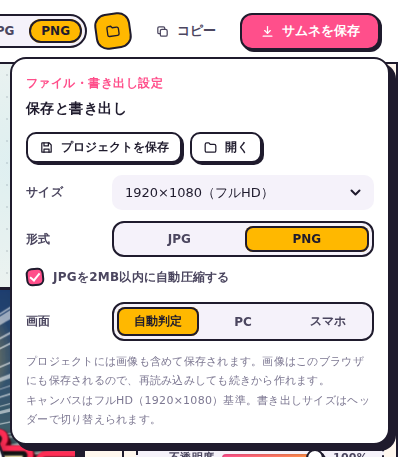

- **プロジェクトを保存／プロジェクトを開く**：作りかけの状態（レイヤー・画像・設定）をファイル（.json）に保存します。あとで「プロジェクトを開く」から続きを編集できます。別の PC に持っていくときやバックアップに使えます。**画像として書き出す**ときは、右上の「サムネを保存」（PNG／JPG）を使います（ヘッダーの「プロジェクト」ボタンからこのメニューを開きます）
- **JPG を 2MB 以内に自動圧縮する**：YouTube のサムネ上限に収まるよう圧縮します
- **画面**：自動判定／PC／スマホ の切り替え
- **自動保存**：作業内容と読み込んだ画像は、ブラウザの中に自動で保存されます

> データはすべて使っている人のブラウザの中だけに保存されます。サーバーには送信されません。
> ブラウザのサイトデータを消すと作業内容も消えるので、大事なものは「プロジェクトを保存」しておいてください。

## 14. 文字素材モード（透過PNG）

ヘッダーの「**文字素材**」に切り替えると、文字だけを背景透過の PNG で書き出せます。動画編集ソフトや OBS のテロップ素材に使えます。

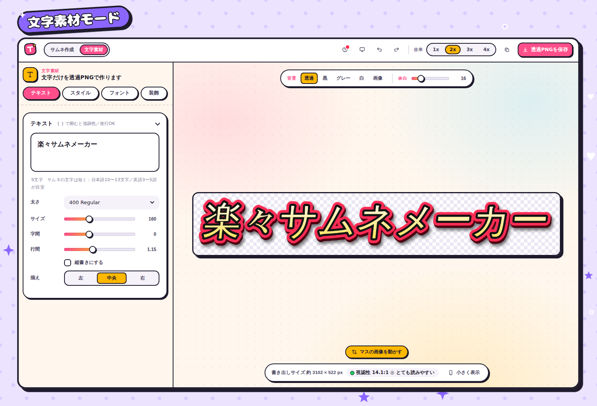

- 設定パネルは「テキスト／スタイル／フォント／装飾」の4つのタブです（サムネ作成と同じ使い方）
- **倍率**（ヘッダー）：1x〜4x（大きいほど高解像度）
- **背景**：透過／黒／グレー／白／画像。プレビューの確認用で、書き出しは透過になります
- **余白**：文字のまわりの余白

## 15. スマホでの使い方

スマホで開くと、自動でスマホ用の画面になります。ヘッダーの画面アイコンか、ファイルメニューの「画面」で手動でも切り替えられます。

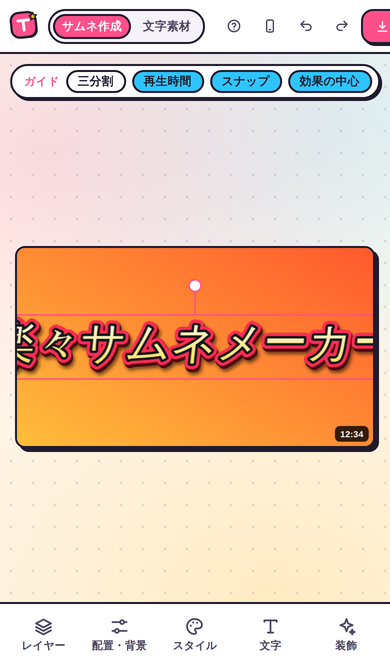
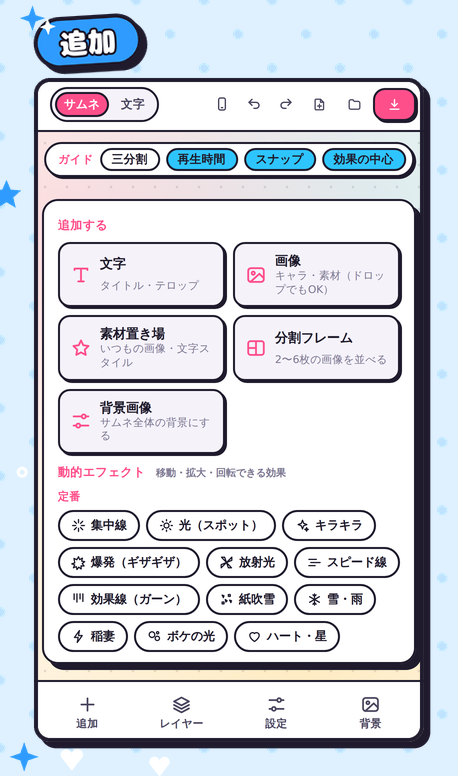
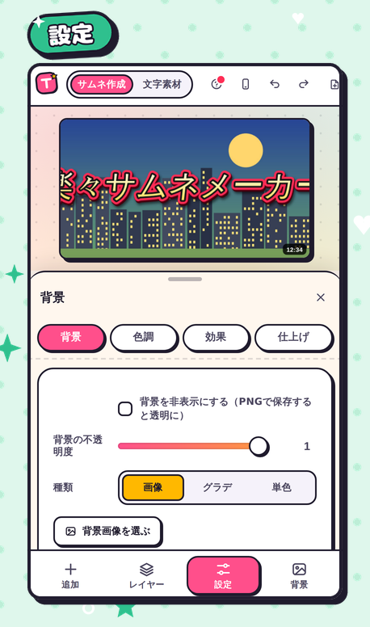
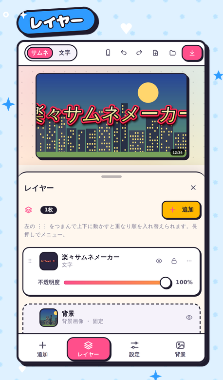

- **下のバー**
  - **追加**：追加メニュー
  - **レイヤー**：レイヤーパネル
  - **設定**：選んでいるものの設定（PC の左パネルと同じタブ）
  - **背景**：選択を外して背景の設定を開く
  - もう一度タップするか、上の × で閉じます
- **タッチ操作**

  | 操作 | 内容 |
  |---|---|
  | タップ | 選択 |
  | 1本指ドラッグ | 移動 |
  | 2本指ピンチ | 拡大縮小＋回転（何も選んでいなければ背景。フレーム調整・マスの調整中はその大きさ） |
  | ダブルタップ | 文字：入力／フレーム付き画像：フレーム調整／分割フレーム：マスの調整 |
  | 長押し | レイヤーメニュー |

- 保存すると共有メニューが開きます。「画像を保存」を選ぶと写真アプリに入ります

## 16. ショートカット一覧

| キー | 内容 |
|---|---|
| `Ctrl` + `Z` | 元に戻す |
| `Ctrl` + `Shift` + `Z` | やり直し |
| `Ctrl` + `S` | 保存（書き出し） |
| `Ctrl` + `D` | 複製 |
| `Ctrl` + `G` / `Ctrl` + `Shift` + `G` | 選んだレイヤーをグループにする／グループを解除 |
| `Ctrl` + `]` / `[` | 前面へ／背面へ（`Shift` 付きで最前面／最背面） |
| `←` `↑` `↓` `→` | 1px 移動（`Shift` 付きで 10px） |
| `Delete` | 削除 |
| `H` / `V` | 画像を左右反転／上下反転 |
| `Esc` | 選択解除／フレーム調整・マスの調整・メニューを閉じる |
| `Ctrl` + `V` | 画像を貼り付けてレイヤーに追加 |
| `?` | 操作ガイドを開く |

Mac では `Ctrl` の代わりに `⌘` を使います。

## 17. こまったときは

| こまりごと | 対処 |
|---|---|
| 設定したい項目が見つからない | まず設定したいもの（文字・画像など）を選び、左の設定パネルのタブを見てください。背景の設定は、何も選んでいないときに出ます |
| 文字が小さく読みにくい | 下の「視認性」が ◎ になる配色にする。「小さく表示」でスマホでの見え方を確認 |
| 失敗した | `Ctrl+Z` か上の ↶ で戻せます |
| 文字のスタイルを最初からやり直したい | 文字を選んで「スタイル」タブの「初期化」（文字はそのまま残ります） |
| PC のフォントが一覧に出ない | 「フォント」タブの「PC にインストール済みのフォントを読む」を押す。それでも出ない場合は「PC内のフォント名を入力して追加」 |
| 文字や画像がつかめない | レイヤーがロックされていないか確認（🔒）。重なっている場合は Alt＋クリックかレイヤーパネルから選ぶ |
| 集中線がキャラにかぶる | レイヤーパネルで集中線をキャラより下にドラッグ |
| ページを開くと翻訳するか聞かれる | 日本語ページとして設定しているので通常は出ません。出た場合は「翻訳しない」を選んでください |
| 作ったものが消えた | 別のブラウザ・シークレットウィンドウでは保存内容が共有されません。いつものブラウザで開いてください |
