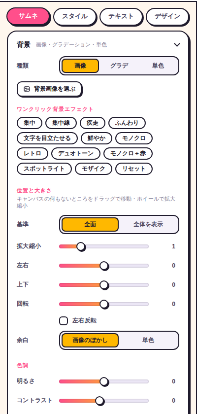
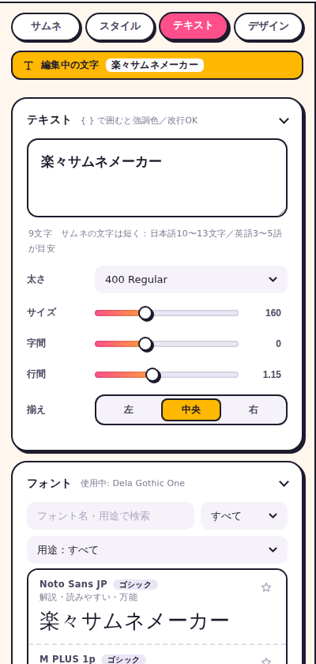
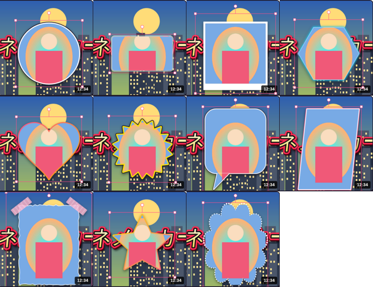

# 楽ちんサムネメーカー 操作マニュアル

**▶ ツールを開く：https://crash-san1999.github.io/rakuchin-thumb-maker/**

ブラウザだけで使える、YouTube・配信向けのサムネイル作成ツールです。インストールもログインも不要で、PC でもスマホでも使えます。

## 目次

1. [はじめに：3分でサムネを作る](#1-はじめに3分でサムネを作る)
2. [画面の見かた](#2-画面の見かた)
3. [背景](#3-背景)
4. [文字](#4-文字)
5. [スタイルと配色](#5-スタイルと配色)
6. [デザイン（文字の装飾）](#6-デザイン文字の装飾)
7. [フォント](#7-フォント)
8. [画像を重ねる](#8-画像を重ねる)
9. [エフェクト：背景エフェクトと動的エフェクト](#9-エフェクト背景エフェクトと動的エフェクト)
10. [レイヤー](#10-レイヤー)
11. [キャンバスの操作とガイド](#11-キャンバスの操作とガイド)
12. [保存・書き出し](#12-保存書き出し)
13. [文字素材モード（透過PNG）](#13-文字素材モード透過png)
14. [スマホでの使い方](#14-スマホでの使い方)
15. [ショートカット一覧](#15-ショートカット一覧)
16. [こまったときは](#16-こまったときは)

---

## 1. はじめに：3分でサムネを作る

| 手順 | やること |
|---|---|
| ① 背景 | 左の「サムネ」タブ →「背景画像を選ぶ」。画像をキャンバスにドラッグ＆ドロップして「背景にする」に離してもOK |
| ② 文字 | 「テキスト」タブで文字を入力。`{ }` で囲んだ部分は強調色になります |
| ③ スタイル | 「スタイル」タブでプリセットを1つクリック。気に入らなければ「配色シャッフル」 |
| ④ 仕上げ | 集中線などが欲しければ右のレイヤーパネルの ✦ から動的エフェクトを追加 |
| ⑤ 保存 | 右上の「サムネを保存」で PNG／JPG を書き出し |

作業内容はブラウザに自動で保存されるので、タブを閉じても次に開いたときに続きから作れます。

起動時に表示される「かんたん操作ガイド」は、右上の **？** ボタンか `?` キーでいつでも開けます。

## 2. 画面の見かた

| 場所 | 内容 |
|---|---|
| ヘッダー左 | **サムネ作成／文字素材** の切り替え |
| ヘッダー右 | ヘルプ、PC／スマホ表示の切り替え、元に戻す／やり直し、書き出しサイズ、JPG／PNG、コピー、保存 |
| 左パネル | 4つのタブ：**サムネ**（レイヤー設定・背景・保存）、**スタイル**（プリセット・配色）、**テキスト**（文字・フォント）、**デザイン**（装飾の細かい設定） |
| 中央 | キャンバス（1920×1080 基準）。上にガイド、下に情報バー（視認性・小さく表示） |
| 右パネル | レイヤー一覧。上にあるほど手前に表示されます |

## 3. 背景

「サムネ」タブの「背景」で設定します。

- **種類**：画像／グラデ／単色
- **位置と大きさ**：拡大縮小・左右・上下・回転・左右反転。キャンバスの何もないところをドラッグすると背景が動き、ホイールで拡大縮小できます
- **基準**：「全面」は隙間なく敷き詰め、「全体を表示」は画像全体が見えるように収めます（余った部分は「画像のぼかし」か「単色」で埋めます）
- **色調**：明るさ・コントラスト・彩度など
- **ワンクリック背景エフェクト**：集中、集中線、疾走、ふんわり、文字を目立たせる、鮮やか、モノクロ、レトロ、デュオトーン、モノクロ＋赤、スポットライト、モザイク、リセット

> ワンクリックの「集中線」「スポットライト」は、動的エフェクトのレイヤーを自動で作ります（→ [9章](#9-エフェクト背景エフェクトと動的エフェクト)）。

## 4. 文字

「テキスト」タブで入力します。

- 改行するとそのまま複数行になります
- `{ }` で囲んだ部分は **強調色** になります（例：`今日は{神回}確定`）
- 文字レイヤーは複数置けます。「文字を追加」ボタンか、レイヤーパネルの **T** で追加
- キャンバス上の文字をダブルクリック（スマホはダブルタップ）すると、その文字を編集できます

## 5. スタイルと配色

「スタイル」タブです。

- **プリセット**：対戦格闘、メタル金、ネオン、炎、ホラーなど 40 種類以上。文字はそのままで見た目だけ変わります。カテゴリで絞り込めます
- **今の設定を保存**：自分で調整したスタイルをプリセットとして保存
- **配色シャッフル**：色だけをランダムに変更。横のメニューで「補色」「類似色」「パステル」「ダーク・ネオン」などの方向性を選べます
- **文字の塗り色は変えない**：チェックすると塗り色を固定したままシャッフルします
- **サムネおすすめ／カラーテーマ**：実績のある配色パターンをワンクリックで適用
- **全体の色調整**：色相・彩度・明るさをまとめて動かせます
- **背景画像から配色**：背景画像の色に合う配色を自動で作ります
- **初期化**：スタイルを最初の状態に戻します

## 6. デザイン（文字の装飾）

「デザイン」タブでは、選んでいる文字レイヤーの装飾を細かく調整できます。上部に「編集中の文字」が表示されます。

主な項目：

- **文字の塗り**：単色／グラデ／2色分割／金属
- **強調色**：`{ }` 部分の色
- **フチ**：何重にも重ねられます（内側→外側の順）
- **立体・影・光彩・ベベル・金属光沢**
- **変形**：ワープ変形、傾き・回転、ゆがみ、文字ゆらぎ
- **演出**：傍点、一文字囲み、背景シェイプ、模様、グリッチ、残像、炎、ドリップ、キラキラ、看板の電飾風、鏡面反射、床に映り込み

各セクションの右上のスイッチでオン／オフを切り替えられます。

## 7. フォント

「テキスト」タブの「フォント」で選びます。

### 最初から使えるフォント

設定やキーは不要で、次のフォントが最初から一覧に入っています。

| 種類 | 数 | 内容 |
|---|---|---|
| Google Fonts 日本語 | 68 | Dela Gothic One、LINE Seed JP、BIZ UDゴシック、Rock 3D など日本語対応の全書体 |
| Google Fonts 欧文 | 約1,860 | 英数字用。「すべて」には厳選した書体だけが出ます。全書体は「欧文」を選ぶか名前で検索 |
| Webフリー | 35 | Google 以外で配信されているフリーフォント（下の表） |

**Webフリーのおもな書体**（カテゴリ「Webフリー」で絞り込めます）

| フォント | 特徴 |
|---|---|
| Genjyuu Gothic（源柔ゴシック） | 角の丸い太めのゴシック。1書体約3.5MBあり、選んだときに読み込みます |
| Fusion Pixel JP（10px / 12px） | 漢字まで入ったドットフォント。ゲーム系に |
| PixelMplus 10 / 12 | 漢字入りのドットフォント（約1.2MB）。太字もあり |
| x12y16pxMaruMonica（マルモニカ）／ x12y12pxMaruMinya（まるみーにゃ） | 丸みのある漢字入りドットフォント（約3MB） |
| 築豊明朝（Tsukuhou Mincho） | 築地活字風のかなが特徴の明朝体（約7.4MB） |
| 源泉丸ゴシック（GenSen Rounded 2 JP） | 丸ゴシック。太さ 400 / 700 / 900（1書体約16MB） |
| 源石ゴシック（GenSeki Gothic 2 JP） | 少し古風なゴシック。太さ 400 / 700 / 900（1書体約16MB） |
| 源流明朝（GenRyuMin 2 JP） | 明朝体。太さ 400 / 700 / 900（1書体約16MB） |
| Fusion Kai J | 楷書体（約5.7MB・選んだときに読み込み） |
| Nico Moji（ニコモジ）／ Nikukyu（にくきゅう） | ポップな手作り風。かな・英数字のみ（漢字は別の書体で表示） |
| Hannari（はんなり明朝）／ Kokoro（こころ明朝） | やさしい明朝体 |
| Norwester、Peace Sans、Blackout など | 英数字用のインパクト系 |
| DSEG7 / DSEG14 | デジタル時計・電光掲示板風の数字 |

1MB を超えるフォントは、一覧をスクロールしただけでは読み込まず、選んだときに読み込みます（「選ぶと読込」と表示）。一度読み込めば、次からはすぐに表示されます。約16MBの源泉丸ゴシックなどは、スマホの通信量に気をつけてください。

Webフリーのフォントは、それぞれのライセンスで配布されています。原本のファイルをそのまま、配布元（Google Fonts、Fontsource、作者の GitHub リポジトリ）から jsDelivr 経由で読み込んでいます。

| フォント | 作者・配布元 | ライセンス |
|---|---|---|
| 源柔ゴシック | 自家製フォント工房 | SIL OFL 1.1 |
| Fusion Pixel / Fusion Kai | TakWolf、lxgw | SIL OFL 1.1 |
| PixelMplus | itouhiro、M+ FONTS PROJECT | M+ FONT LICENSE |
| マルモニカ・まるみーにゃ | hicc（[x0y0pxFreeFont](https://hicchicc.github.io/00ff/)） | 作者独自ライセンス（商用・再配布可） |
| 築豊明朝 | iose-sakana | SIL OFL 1.1 |
| 源泉丸ゴシック・源石ゴシック・源流明朝 | ButTaiwan | SIL OFL 1.1 |
| ニコモジ・にくきゅう・はんなり明朝・こころ明朝 | Google Fonts Early Access | SIL OFL 1.1 |

### 探す・選ぶ

- **検索・カテゴリ・用途**：「ゲーム・インパクト」「かわいい・ポップ」「和風・筆」など用途から探せます
- **英数字**：英字・数字だけ別のフォントにできます（例：「RANK UP」「No.1」）。一覧の欧文フォントにある「英数字」ボタンからも設定できます
- **お気に入り**：よく使うフォントを登録。お気に入りにした欧文は「英数字」の選択肢にも出ます

### フォントを増やす

- **最新のフォント一覧に更新**：Google Fonts に新しく追加された日本語フォントを取り込みます。週に1回は自動でも確認します
- **WebフォントのURLを貼り付け**：次のURLに対応しています。追加したフォントは次回も一覧に残ります
  - Google Fonts のフォントのページ（`https://fonts.google.com/specimen/…`）
  - Google Fonts の CSS（`https://fonts.googleapis.com/css2?family=…`）
  - Fontsource のフォントのページ（`https://fontsource.org/fonts/…`）
  - `@font-face` を書いた CSS のURL
  - フォントファイルのURL（.woff2 / .woff / .ttf / .otf）。配布元が外部サイトからの利用を許可していない場合は読み込めません
- **PC にインストール済みのフォントを読む**（PC のみ）：Chrome / Edge ではインストール済みフォントをすべて読み込めます。初回は「フォントの使用」の許可を求められます。許可できない環境でも、よく使われるフォントは自動で見つけます
- **PC内のフォント名を入力して追加**：一覧に出てこないフォントも、名前を入れれば使えます（例：けいふぉんと）
- **フォントファイル**：.ttf / .otf / .woff / .woff2 をドロップ、またはクリックして選択

> ダウンロード配布だけのフリーフォント（けいふぉんと、にくまるフォントなど）は、PC にインストールしてから「PC にインストール済みのフォントを読む」か、フォントファイルをドロップしてください。

## 8. 画像を重ねる

キャラクターの立ち絵、スタンプ、ロゴなどは **レイヤー** として重ねます。

- **ドラッグ＆ドロップ**：画像ファイルを画面のどこかに落とすとレイヤーとして追加されます（複数まとめてOK）
- 「**背景にする**」の枠に落としたときだけ背景画像になります
- **貼り付け**：画像をコピーして `Ctrl+V`
- **ボタン**：「画像を追加」、またはレイヤーパネルの画像アイコン
- .ttf / .otf（フォント）や .json（プロジェクト）も、同じようにドロップで読み込めます

画像レイヤーを選ぶと、左の「選択中のレイヤー」で次の項目を調整できます。

- 大きさ・回転・不透明度・描画モード
- 白フチ・影
- 配置（9か所へのワンクリック整列）
- 切り抜きフレーム（下を参照）

### 切り抜きフレーム

画像を図形で切り抜いて、枠を付けられます。画像レイヤーを選ぶと、左の「選択中のレイヤー」に「切り抜きフレーム」が出ます。

- **ワンクリック**：アイコン、ワイプ、ポラロイド、ネオン、ハート、バクハツ、吹き出し、ゲーム風、マステ、スター、もこもこ。「フレームなし」で元に戻ります
- **形**（17種類）：四角（角丸）、丸、アーチ、六角形、八角形、ひし形、三角、平行四辺形、盾、星、キラッ、ハート、バクハツ、もこもこ、花、吹き出し、ラフな切り口
- **枠のデザイン**（9種類）：枠なし、単色のフチ、二重線、2色フチ（ポップ）、グラデーション、ネオン、点線、ポラロイド風、マスキングテープ
- 形と枠のデザインは自由に組み合わせられます。枠の色と太さは「フチ色」「フチ太さ」、2色使うデザインは「2色目」で変えます
- **縦横比**：自動／1:1／4:3／3:4／16:9。自動は、四角やアーチなどは元の画像の比率、丸や星などは 1:1 になります
- **中の画像の大きさ・左右・上下**：フレームの中で画像を拡大したり、見せる位置をずらしたりできます（顔を真ん中に合わせるときなど）
- 影を付けると、フレームの形に沿って影が付きます

## 9. エフェクト：背景エフェクトと動的エフェクト

エフェクトは2種類あります。

| | 背景エフェクト | 動的エフェクト |
|---|---|---|
| 何か | 背景全体にかかる効果 | 画像の上に乗せる効果。独立したレイヤー |
| 種類 | 暗くする、周辺減光、グラデーション影、色を重ねる、ぼかし、ズームブラー、モーションブラー、モノクロ、モザイクなど | 集中線、光（スポット）、キラキラ、爆発（ギザギザ） |
| 動かす | 中心位置のみ（黄色い◎ か「中心」スライダー） | 文字や画像と同じように移動・拡大縮小・回転 |
| 重なり順 | 常に背景 | レイヤーパネルで自由に入れ替え（キャラの後ろに集中線、など） |
| 設定場所 | 「サムネ」タブ →「背景」→「背景エフェクト」 | レイヤーを選んで「選択中のレイヤー」 |

### 動的エフェクトの追加

1. 次のどれかから種類を選びます
   - レイヤーパネル上の **✦** ボタン
   - 左の「**エフェクト**」ボタン
   - 背景パネル下の「動的エフェクト」ボタン
2. 今選んでいるレイヤーの **すぐ下** に追加されます。キャラを選んでから追加すると、キャラの後ろに入ります
3. ドラッグで移動、角の □ で拡大縮小、上の ○ で回転します
4. 「選択中のエフェクト」で細かく調整します

| 種類 | 調整できる項目 |
|---|---|
| 集中線 | 色、本数、内側の空き、線の太さ、長さ、ランダム |
| 光（スポット） | 色、強さ、光の広がり（描画モードは初期値「スクリーン」） |
| キラキラ | 色、数、大きさ、光彩、ランダム |
| 爆発（ギザギザ） | 塗り色、フチ色、フチの太さ、トゲの数、トゲの深さ、ランダム |

### 背景エフェクトの中心

周辺減光とズームブラーの中心は、ずらすことができます。

- 何も選んでいないときにキャンバスに出る **黄色い◎** をドラッグ
- 「中心 左右／上下」スライダーで調整
- 「中心を真ん中に」で元に戻す

上のガイドの「**効果の中心**」で、◎ の表示を切り替えられます。

### ワンクリックとの関係

ワンクリック背景エフェクトの「集中線」「スポットライト」を押すと、動的エフェクトのレイヤーが自動で作られます。

- 作られたレイヤーは、あとから移動・調整できます
- 別のワンクリックに切り替えると、自動で作られたレイヤーは入れ替わります
- 自分で追加した動的エフェクトはそのまま残ります

## 10. レイヤー

右のレイヤーパネルで、文字・画像・動的エフェクトを管理します。

| 操作 | PC | スマホ |
|---|---|---|
| 選択 | 行をクリック | 行をタップ |
| 重なり順の入れ替え | 行をドラッグ（上にあるほど手前） | 左の ⋮⋮ をつまんで上下 |
| 表示／非表示 | 👁 | 👁 |
| ロック（キャンバス上で動かなくなる） | 🔒 | 🔒 |
| 名前を変更 | ダブルクリック | メニューから |
| メニュー | 右クリック／… | 長押し／… |

メニューには、最前面へ、前面へ、背面へ、最背面へ、複製、名前を変更、ロック、削除があります。

背景は一番下に固定です。「背景」の行を選ぶと、背景の設定が開きます。

## 11. キャンバスの操作とガイド

| 操作（PC） | 内容 |
|---|---|
| クリック | 文字・画像・エフェクトを選択 |
| ドラッグ | 移動（中央・三分割線に吸い付く／Alt で無効） |
| 角の □ をドラッグ | 拡大縮小 |
| 上の ○ をドラッグ | 回転（Shift で 15° ずつ） |
| ホイール | 選択中のレイヤー、または背景を拡大縮小 |
| 何もない所をドラッグ | 背景画像を移動 |
| ダブルクリック | 文字を編集 |
| 右クリック | レイヤーメニュー |
| Alt＋クリック | 重なった下のレイヤーを選ぶ |
| 黄色い ◎ をドラッグ | 背景エフェクトの中心を移動 |

**ガイド**（キャンバス上部）

- **三分割**：構図の目安になる三分割線
- **再生時間**：YouTube の再生時間表示（右下）の位置。文字がかぶらないかの確認用。書き出しには入りません
- **スナップ**：中央・三分割線への吸い付きのオン／オフ
- **効果の中心**：背景エフェクトの中心 ◎ の表示

**情報バー**（キャンバス下部）

- **視認性**：文字の塗りと、そのすぐ外側（フチ・影・背景）の明るさの差です。◎ なら小さく表示されても読みやすい目安になります
- **小さく表示**：YouTube のおすすめ欄くらいの大きさで見え方を確認できます

## 12. 保存・書き出し

- **サムネを保存**（右上）：画像ファイルとして書き出します
  - 形式：PNG（初期値）／JPG
  - サイズ：1280×720、1920×1080（フルHD）、2560×1440、3840×2160（4K）
  - 「JPG を 2MB 以内に自動圧縮する」をオンにすると、YouTube のサムネ上限に収まるよう圧縮します
- **コピー**：クリップボードにコピーします。Discord や X にそのまま貼り付けられます
- **プロジェクトを保存／開く**（「サムネ」タブ下部）：画像も含めて .json に保存します。別の PC に持っていくときやバックアップに使えます
- **自動保存**：作業内容と読み込んだ画像は、ブラウザの中に自動で保存されます

> データはすべて使っている人のブラウザの中だけに保存されます。サーバーには送信されません。
> ブラウザのサイトデータを消すと作業内容も消えるので、大事なものは「プロジェクトを保存」しておいてください。

## 13. 文字素材モード（透過PNG）

ヘッダーの「**文字素材**」に切り替えると、文字だけを背景透過の PNG で書き出せます。動画編集ソフトや OBS のテロップ素材に使えます。

- **倍率**：1x〜4x（大きいほど高解像度）
- **背景**：透過／黒／グレー／白／画像。プレビューの確認用で、書き出しは透過になります
- **余白**：文字のまわりの余白
- スタイル・テキスト・デザイン・フォントの各タブは、サムネ作成と同じように使えます

## 14. スマホでの使い方

スマホで開くと、自動でスマホ用の画面になります。ヘッダーの画面アイコンか、「保存と書き出し」の「画面」で手動でも切り替えられます。

- 下のバー（レイヤー／配置・背景／スタイル／文字／装飾）をタップするとパネルが開きます。もう一度タップすると閉じます
- タッチ操作

  | 操作 | 内容 |
  |---|---|
  | タップ | 選択 |
  | 1本指ドラッグ | 移動 |
  | 2本指ピンチ | 拡大縮小＋回転（何も選んでいなければ背景） |
  | ダブルタップ | 文字を編集 |
  | 長押し | レイヤーメニュー |

- 保存すると共有メニューが開きます。「画像を保存」を選ぶと写真アプリに入ります

## 15. ショートカット一覧

| キー | 内容 |
|---|---|
| `Ctrl` + `Z` | 元に戻す |
| `Ctrl` + `Shift` + `Z` | やり直し |
| `Ctrl` + `S` | 保存（書き出し） |
| `Ctrl` + `D` | 複製 |
| `Ctrl` + `]` / `[` | 前面へ／背面へ（`Shift` 付きで最前面／最背面） |
| `←` `↑` `↓` `→` | 1px 移動（`Shift` 付きで 10px） |
| `Delete` | 削除 |
| `Esc` | 選択解除 |
| `Ctrl` + `V` | 画像を貼り付けてレイヤーに追加 |
| `?` | 操作ガイドを開く |

Mac では `Ctrl` の代わりに `⌘` を使います。

## 16. こまったときは

| こまりごと | 対処 |
|---|---|
| 文字が小さく読みにくい | 下の「視認性」が ◎ になる配色にする。「小さく表示」でスマホでの見え方を確認 |
| 失敗した | `Ctrl+Z` か上の ↶ で戻せます |
| 最初からやり直したい | 「スタイル」タブの「初期化」 |
| PC のフォントが一覧に出ない | 「PC にインストール済みのフォントを読む」を押す。それでも出ない場合は「PC内のフォント名を入力して追加」 |
| 文字や画像がつかめない | レイヤーがロックされていないか確認（🔒）。重なっている場合は Alt＋クリックかレイヤーパネルから選ぶ |
| 集中線がキャラにかぶる | レイヤーパネルで集中線をキャラより下にドラッグ |
| ページを開くと翻訳するか聞かれる | 日本語ページとして設定しているので通常は出ません。出た場合は「翻訳しない」を選んでください |
| 作ったものが消えた | 別のブラウザ・シークレットウィンドウでは保存内容が共有されません。いつものブラウザで開いてください |
